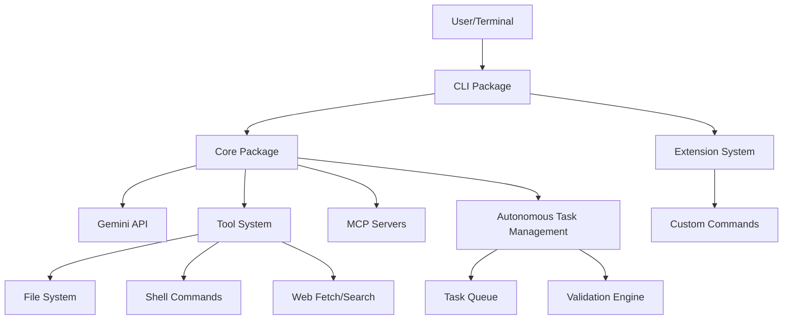
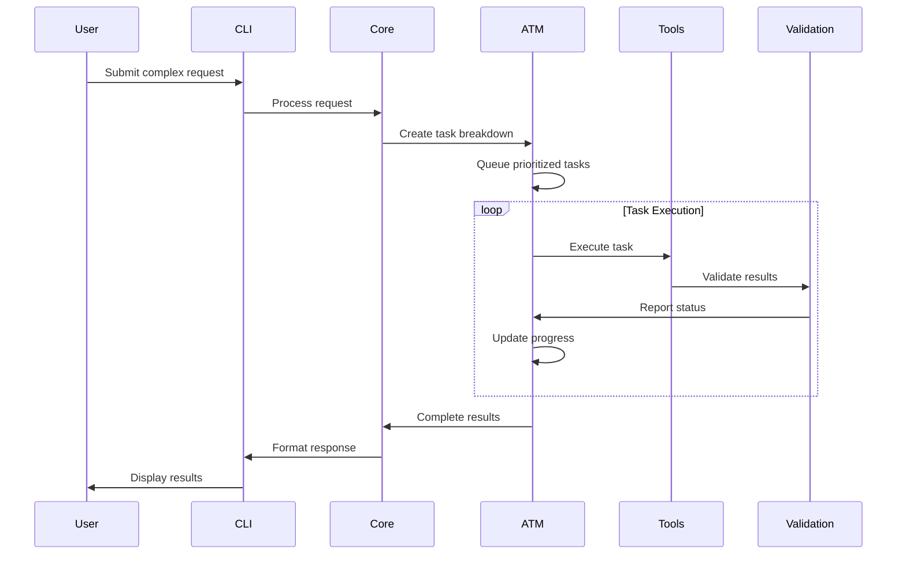

# Gemini CLI System Architecture

## Overview

Gemini CLI is a sophisticated AI-powered command-line interface built with a modular, extensible architecture. This document provides comprehensive architectural documentation for developers and maintainers.

## High-Level Architecture



## Core Components

### 1. CLI Package (`packages/cli/`)

**Purpose**: User-facing interface and interaction management

**Key Responsibilities**:

- Input processing and command parsing
- Output formatting and display rendering
- User authentication and session management
- Configuration management
- Theme and UI customization
- History management
- Extension loading and management

**Key Files**:

- `src/ui/` - User interface components
- `src/commands/` - Built-in slash commands
- `src/config/` - Configuration management
- `src/services/` - Core services (command loading, prompt processing)

### 2. Core Package (`packages/core/`)

**Purpose**: Backend engine and API orchestration

**Key Responsibilities**:

- Gemini API client and communication
- Prompt construction and context management
- Tool registration and execution coordination
- State management for conversations
- Model selection and configuration
- Response processing and streaming
- Error handling and retry logic

**Key Components**:

- API Client layer for Gemini communication
- Tool execution framework
- Context management system
- Model configuration and selection
- Response parsing and validation

### 3. Tool System (`packages/core/src/tools/`)

**Purpose**: Extensible capability framework

**Built-in Tools**:

- **File System Tools**: Read, write, search files and directories
- **Shell Tools**: Execute system commands with safety controls
- **Web Tools**: Fetch web content and perform searches
- **Multi-file Tools**: Batch operations across multiple files
- **Memory Tools**: Context persistence and retrieval

**Tool Architecture**:

- Base tool interface with standardized execution flow
- Permission system for secure operations
- Result validation and error handling
- Tool discovery and registration system

### 4. Extension System

**Purpose**: Plugin architecture for custom functionality

**Components**:

- Extension loader and manager
- Custom command registration
- Variable substitution system
- GitHub integration for extension distribution
- Security sandboxing for third-party extensions

### 5. Autonomous Task Management (ATM)

**Purpose**: Self-managing task orchestration system

**Key Features**:

- **Task Queue Management**: Priority-based task scheduling
- **Autonomous Breakdown**: Complex task decomposition
- **Cross-session Persistence**: Task state preservation
- **Validation Cycles**: Automated task completion validation
- **Dependency Resolution**: Intelligent task sequencing
- **Progress Monitoring**: Real-time status tracking

**Components**:

- Task Queue Engine
- Validation Framework
- Persistence Layer
- Monitoring and Analytics
- Agent Coordination System

## Data Flow Architecture

### Request Processing Flow

1. **Input Stage**:

   ```
   User Input → CLI Parser → Command Router → Prompt Processor
   ```

2. **Processing Stage**:

   ```
   Core Engine → Context Builder → API Request → Gemini API
   ```

3. **Tool Execution Stage**:

   ```
   Tool Request → Permission Check → Tool Execution → Result Validation
   ```

4. **Response Stage**:
   ```
   API Response → Response Parser → Output Formatter → User Display
   ```

### Task Management Flow



## Configuration Architecture

### Settings Hierarchy

1. **System Defaults**: Built-in default configurations
2. **Global Settings**: User-wide preferences (`~/.gemini/settings.json`)
3. **Project Settings**: Project-specific overrides (`.gemini/settings.json`)
4. **Environment Variables**: Runtime configuration overrides
5. **Command-line Arguments**: Session-specific overrides

### Configuration Schema

```typescript
interface GeminiSettings {
  // Authentication settings
  auth: {
    method: 'oauth' | 'api-key' | 'vertex-ai';
    credentials?: AuthCredentials;
  };

  // Model configuration
  model: {
    name: string;
    temperature?: number;
    topP?: number;
    maxTokens?: number;
  };

  // Tool configuration
  tools: {
    enabled: string[];
    permissions: ToolPermissions;
  };

  // MCP server configuration
  mcpServers: McpServerConfig[];

  // Extension configuration
  extensions: ExtensionConfig[];

  // UI preferences
  ui: {
    theme: string;
    keyBindings: KeyBindingConfig;
  };
}
```

## Security Architecture

### Permission Model

- **Read-only Operations**: Automatic approval for safe operations
- **Write Operations**: User confirmation required
- **Shell Commands**: Explicit permission with command preview
- **Network Operations**: Configurable permission levels
- **File System Access**: Sandboxed to project directories

### Security Layers

1. **Input Validation**: Sanitize all user inputs
2. **Command Sandboxing**: Isolate shell command execution
3. **File System Permissions**: Restrict file access scope
4. **Network Security**: Validate external requests
5. **Extension Security**: Sandbox third-party extensions

## Performance Architecture

### Optimization Strategies

1. **Token Caching**: Cache responses for repeated queries
2. **Context Compression**: Intelligent context window management
3. **Streaming Responses**: Real-time response rendering
4. **Lazy Loading**: Load extensions and tools on demand
5. **Memory Management**: Efficient state cleanup

### Monitoring Points

- API response times
- Token usage tracking
- Memory consumption
- File system operation performance
- Tool execution metrics

## Extensibility Architecture

### MCP (Model Context Protocol) Integration

```typescript
interface McpServer {
  name: string;
  command: string[];
  args?: string[];
  env?: Record<string, string>;
  tools: McpTool[];
}
```

### Extension Points

1. **Custom Commands**: Add new slash commands
2. **Tool Extensions**: Create new tool capabilities
3. **Prompt Processors**: Custom input processing
4. **Output Formatters**: Custom response rendering
5. **Authentication Providers**: Additional auth methods

## Deployment Architecture

### Development Environment

```
Local Development → Build System → Testing Pipeline → Package Distribution
```

### Distribution Channels

- **NPM Package**: `@google/gemini-cli`
- **Homebrew Formula**: `brew install gemini-cli`
- **Direct GitHub**: `npx https://github.com/google-gemini/gemini-cli`

### Container Support

- Docker images for isolated environments
- VS Code dev container configuration
- Kubernetes deployment manifests

## Error Handling Architecture

### Error Categories

1. **User Input Errors**: Invalid commands or syntax
2. **API Errors**: Gemini API failures or rate limits
3. **Tool Errors**: File system or command execution failures
4. **System Errors**: Configuration or dependency issues
5. **Network Errors**: Connectivity or timeout issues

### Error Recovery Strategies

- Automatic retry with exponential backoff
- Graceful degradation for non-critical failures
- User notification with actionable suggestions
- Error logging and analytics collection

## Testing Architecture

### Test Categories

1. **Unit Tests**: Individual component validation
2. **Integration Tests**: Cross-component interaction testing
3. **E2E Tests**: Full workflow validation
4. **Performance Tests**: Load and stress testing
5. **Security Tests**: Vulnerability scanning

### Test Infrastructure

- Vitest for unit and integration testing
- Mock services for API simulation
- Test fixtures for reproducible scenarios
- CI/CD integration for automated testing

## Monitoring and Observability

### Telemetry Collection

- Usage analytics and feature adoption
- Error tracking and debugging information
- Performance metrics and optimization data
- Security audit logs

### Health Monitoring

- System resource utilization
- API response time tracking
- Error rate monitoring
- User experience metrics

## Future Architecture Considerations

### Scalability Enhancements

- Distributed task processing
- Multi-user collaboration features
- Cloud-native deployment options
- Advanced caching strategies

### Integration Roadmap

- IDE plugin architecture
- CI/CD pipeline integration
- Enterprise authentication systems
- Advanced analytics and reporting

---

This architecture is designed for:

- **Modularity**: Clean separation of concerns
- **Extensibility**: Support for community contributions
- **Scalability**: Growth from individual to enterprise use
- **Reliability**: Robust error handling and recovery
- **Security**: Defense-in-depth security model
