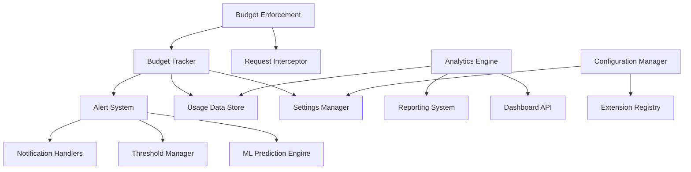

# Budget System Developer Integration Guide

## Overview

This comprehensive guide enables developers to extend, customize, and integrate with the Gemini CLI Budget Management system. Learn how to build custom alert handlers, create analytics plugins, implement budget enforcement strategies, and extend the visualization dashboard.

## Table of Contents

- [Architecture Overview](#architecture-overview)
- [Core Components](#core-components)
- [Extension Points](#extension-points)
- [Custom Alert Handlers](#custom-alert-handlers)
- [Analytics Plugins](#analytics-plugins)
- [Budget Enforcement Strategies](#budget-enforcement-strategies)
- [Dashboard Customization](#dashboard-customization)
- [API Integration](#api-integration)
- [Plugin Development](#plugin-development)
- [Testing & Debugging](#testing--debugging)
- [Best Practices](#best-practices)

## Architecture Overview

### System Components



### Key Classes and Interfaces

```typescript
// Core budget tracking
class BudgetTracker {
  private settings: BudgetSettings;
  private alertSystem: BudgetAlertSystem;
  private usageData: BudgetUsageData;
}

// Alert system with extensible handlers
class BudgetAlertSystem {
  private notificationHandlers: Map<string, NotificationHandler>;
  private thresholds: AlertThreshold[];
}

// Enforcement engine for request blocking
class BudgetEnforcement {
  private tracker: BudgetTracker;
  private interceptor: RequestInterceptor;
}

// Analytics and reporting
class BudgetAnalytics {
  private dataStore: UsageDataStore;
  private reportGenerators: ReportGenerator[];
}
```

## Core Components

### BudgetTracker

The central component managing budget state and coordination:

```typescript
import { BudgetTracker, BudgetSettings } from '@google/gemini-cli-core';

// Initialize tracker with custom settings
const tracker = new BudgetTracker('/project/root', {
  enabled: true,
  dailyLimit: 200,
  resetTime: '00:00',
  alerts: {
    enabled: true,
    thresholds: [
      {
        id: 'custom-warning',
        percentage: 85,
        severity: 'warning',
        channels: ['email', 'slack'],
      },
    ],
  },
});

// Record API usage
await tracker.recordRequest();

// Check budget status
const stats = await tracker.getUsageStats();
console.log(`Usage: ${stats.usagePercentage}%`);

// Get alert system for customization
const alertSystem = tracker.getAlertSystem();
```

### Usage Data Store

Manage persistent budget data:

```typescript
interface BudgetUsageData {
  date: string;
  requestCount: number;
  lastResetTime: string;
  warningsShown: number[];
  alertsSent: AlertRecord[];

  // ML predictions and insights
  mlPredictions?: {
    dailyForecast: ForecastPoint[];
    recommendations: MLBudgetRecommendation[];
    riskAssessment: MLRiskAssessment;
  };
}

// Extend usage data with custom fields
interface CustomUsageData extends BudgetUsageData {
  customMetrics: {
    costEstimate: number;
    modelUsage: Record<string, number>;
    projectBreakdown: Record<string, number>;
  };
}
```

### Configuration System

Flexible configuration management:

```typescript
interface BudgetSettings {
  enabled?: boolean;
  dailyLimit?: number;
  resetTime?: string;
  warningThresholds?: number[];

  // Extensible alert configuration
  alerts?: {
    enabled: boolean;
    thresholds: AlertThreshold[];
    notifications: NotificationConfig;
    aggregation: AlertAggregation;
    predictive: PredictiveAlerts;
  };

  // Plugin configurations
  plugins?: Record<string, unknown>;
}
```

## Extension Points

### 1. Custom Notification Handlers

Create custom alert delivery channels:

```typescript
interface NotificationHandler {
  send(context: AlertContext, config: NotificationConfig): Promise<boolean>;
  validate(config: NotificationConfig): boolean;
}

class SlackNotificationHandler implements NotificationHandler {
  async send(
    context: AlertContext,
    config: NotificationConfig,
  ): Promise<boolean> {
    const { threshold, usage } = context;

    const slackMessage = {
      text: `🚨 Budget Alert: ${threshold.name}`,
      attachments: [
        {
          color: this.getSeverityColor(threshold.severity),
          fields: [
            {
              title: 'Usage',
              value: `${usage.percentage.toFixed(1)}% (${usage.requestCount}/${usage.dailyLimit})`,
              short: true,
            },
            {
              title: 'Remaining',
              value: `${usage.remainingRequests} requests`,
              short: true,
            },
            {
              title: 'Reset Time',
              value: usage.timeUntilReset,
              short: true,
            },
          ],
          actions: [
            {
              type: 'button',
              text: 'Extend Budget',
              url: `https://dashboard.example.com/budget/extend`,
            },
          ],
        },
      ],
    };

    try {
      const response = await fetch(config.webhook?.url!, {
        method: 'POST',
        headers: { 'Content-Type': 'application/json' },
        body: JSON.stringify(slackMessage),
      });

      return response.ok;
    } catch (error) {
      console.error('Slack notification failed:', error);
      return false;
    }
  }

  validate(config: NotificationConfig): boolean {
    return !!(config.webhook?.enabled && config.webhook?.url);
  }

  private getSeverityColor(severity: AlertSeverity): string {
    const colors = {
      info: 'good',
      warning: 'warning',
      critical: 'danger',
      emergency: 'danger',
    };
    return colors[severity] || 'good';
  }
}

// Register the custom handler
const alertSystem = tracker.getAlertSystem();
alertSystem.registerNotificationHandler(
  'slack',
  new SlackNotificationHandler(),
);
```

### 2. Analytics Plugins

Extend analytics capabilities:

```typescript
interface AnalyticsPlugin {
  name: string;
  version: string;
  generateReport(data: BudgetUsageData[], options?: any): Promise<Report>;
  getMetrics(data: BudgetUsageData[]): Promise<Metric[]>;
}

class CostAnalyticsPlugin implements AnalyticsPlugin {
  name = 'cost-analytics';
  version = '1.0.0';

  async generateReport(data: BudgetUsageData[], options = {}): Promise<Report> {
    const { pricingModel = 'standard' } = options;

    const costData = data.map((day) => ({
      date: day.date,
      requests: day.requestCount,
      estimatedCost: this.calculateCost(day.requestCount, pricingModel),
      costPerRequest: this.getCostPerRequest(pricingModel),
    }));

    const totalCost = costData.reduce((sum, day) => sum + day.estimatedCost, 0);
    const avgDailyCost = totalCost / costData.length;

    return {
      title: 'Cost Analysis Report',
      summary: {
        totalCost,
        avgDailyCost,
        projectedMonthlyCost: avgDailyCost * 30,
      },
      data: costData,
      charts: [
        {
          type: 'line',
          title: 'Daily Cost Trend',
          data: costData.map((d) => ({ x: d.date, y: d.estimatedCost })),
        },
      ],
    };
  }

  async getMetrics(data: BudgetUsageData[]): Promise<Metric[]> {
    const totalRequests = data.reduce((sum, day) => sum + day.requestCount, 0);
    const totalCost = data.reduce(
      (sum, day) => sum + this.calculateCost(day.requestCount),
      0,
    );

    return [
      {
        name: 'total_cost',
        value: totalCost,
        unit: 'USD',
        description: 'Total estimated cost for the period',
      },
      {
        name: 'avg_cost_per_request',
        value: totalCost / totalRequests,
        unit: 'USD',
        description: 'Average cost per API request',
      },
    ];
  }

  private calculateCost(requests: number, model = 'standard'): number {
    const pricing = {
      standard: 0.002, // $0.002 per request
      premium: 0.005, // $0.005 per request
      enterprise: 0.001, // $0.001 per request
    };

    return (
      requests * (pricing[model as keyof typeof pricing] || pricing.standard)
    );
  }

  private getCostPerRequest(model: string): number {
    const pricing = {
      standard: 0.002,
      premium: 0.005,
      enterprise: 0.001,
    };
    return pricing[model as keyof typeof pricing] || pricing.standard;
  }
}

// Register the plugin
const analytics = new BudgetAnalytics();
analytics.registerPlugin(new CostAnalyticsPlugin());
```

### 3. Custom Budget Enforcement

Implement custom enforcement strategies:

```typescript
interface EnforcementStrategy {
  name: string;
  shouldBlock(usage: UsageStats, settings: BudgetSettings): Promise<boolean>;
  getBlockMessage(usage: UsageStats): string;
  onRequestBlocked?(usage: UsageStats): Promise<void>;
}

class GracefulDegradationStrategy implements EnforcementStrategy {
  name = 'graceful-degradation';

  async shouldBlock(
    usage: UsageStats,
    settings: BudgetSettings,
  ): Promise<boolean> {
    // Allow requests but with reduced functionality after 90%
    if (usage.usagePercentage >= 100) {
      return true; // Hard block at 100%
    }

    if (usage.usagePercentage >= 90) {
      // Implement rate limiting instead of blocking
      await this.applyRateLimit();
      return false;
    }

    return false;
  }

  getBlockMessage(usage: UsageStats): string {
    if (usage.usagePercentage >= 100) {
      return `Daily budget exceeded. ${usage.remainingRequests} requests remaining. Budget resets in ${usage.timeUntilReset}.`;
    }
    return '';
  }

  async onRequestBlocked(usage: UsageStats): Promise<void> {
    // Log blocked request for analytics
    console.log(`Request blocked - Usage: ${usage.usagePercentage}%`);

    // Send notification to administrators
    await this.notifyAdministrators(usage);
  }

  private async applyRateLimit(): Promise<void> {
    // Implement exponential backoff
    const delay = Math.min(
      1000 * Math.pow(2, this.getCurrentRateLimitLevel()),
      30000,
    );
    await new Promise((resolve) => setTimeout(resolve, delay));
  }

  private getCurrentRateLimitLevel(): number {
    // Implement rate limit level tracking
    return 1;
  }

  private async notifyAdministrators(usage: UsageStats): Promise<void> {
    // Send admin notification
    console.log('Administrator notification sent');
  }
}

// Apply custom enforcement strategy
const enforcement = new BudgetEnforcement('/project/root', settings);
enforcement.setStrategy(new GracefulDegradationStrategy());
```

## Custom Alert Handlers

### Comprehensive Alert Handler Implementation

```typescript
interface AlertContext {
  threshold: AlertThreshold;
  usage: {
    requestCount: number;
    dailyLimit: number;
    percentage: number;
    remainingRequests: number;
    timeUntilReset: string;
  };
  history: {
    recentAlerts: AlertRecord[];
    todayAlertCount: number;
  };
}

abstract class BaseNotificationHandler implements NotificationHandler {
  abstract send(
    context: AlertContext,
    config: NotificationConfig,
  ): Promise<boolean>;
  abstract validate(config: NotificationConfig): boolean;

  protected formatMessage(context: AlertContext): string {
    const { threshold, usage } = context;
    return (
      threshold.message ||
      `${threshold.name}: ${usage.percentage.toFixed(1)}% of budget used (${usage.requestCount}/${usage.dailyLimit} requests)`
    );
  }

  protected shouldSkipDueToAggregation(context: AlertContext): boolean {
    // Implement aggregation logic to prevent spam
    const recentSimilarAlerts = context.history.recentAlerts.filter(
      (alert) =>
        alert.thresholdId === context.threshold.id &&
        Date.now() - new Date(alert.timestamp).getTime() < 15 * 60 * 1000, // 15 minutes
    );

    return recentSimilarAlerts.length >= 3;
  }
}

class TeamsNotificationHandler extends BaseNotificationHandler {
  async send(
    context: AlertContext,
    config: NotificationConfig,
  ): Promise<boolean> {
    if (this.shouldSkipDueToAggregation(context)) {
      return true; // Skip but don't fail
    }

    const { threshold, usage } = context;

    const teamsMessage = {
      '@type': 'MessageCard',
      '@context': 'https://schema.org/extensions',
      summary: threshold.name,
      themeColor: this.getThemeColor(threshold.severity),
      sections: [
        {
          activityTitle: threshold.name,
          activitySubtitle: `Budget Alert - ${threshold.severity.toUpperCase()}`,
          facts: [
            {
              name: 'Usage',
              value: `${usage.percentage.toFixed(1)}% (${usage.requestCount}/${usage.dailyLimit})`,
            },
            {
              name: 'Remaining',
              value: `${usage.remainingRequests} requests`,
            },
            {
              name: 'Reset Time',
              value: usage.timeUntilReset,
            },
            {
              name: 'Severity',
              value: threshold.severity.toUpperCase(),
            },
          ],
          text: this.formatMessage(context),
        },
      ],
      potentialAction: [
        {
          '@type': 'OpenUri',
          name: 'View Dashboard',
          targets: [
            {
              os: 'default',
              uri: 'https://dashboard.example.com/budget',
            },
          ],
        },
      ],
    };

    try {
      const response = await fetch(config.webhook?.url!, {
        method: 'POST',
        headers: {
          'Content-Type': 'application/json',
          ...config.webhook?.headers,
        },
        body: JSON.stringify(teamsMessage),
        signal: AbortSignal.timeout(config.webhook?.timeoutMs || 5000),
      });

      return response.ok;
    } catch (error) {
      console.error('Teams notification failed:', error);
      return false;
    }
  }

  validate(config: NotificationConfig): boolean {
    return !!(
      config.webhook?.enabled &&
      config.webhook?.url?.includes('webhook.office.com')
    );
  }

  private getThemeColor(severity: AlertSeverity): string {
    const colors = {
      info: '0078D4', // Microsoft blue
      warning: 'FF8C00', // Orange
      critical: 'D13438', // Red
      emergency: '8B0000', // Dark red
    };
    return colors[severity] || colors.info;
  }
}

// Advanced SMS handler with rate limiting
class SMSNotificationHandler extends BaseNotificationHandler {
  private rateLimitStore = new Map<string, number[]>();

  async send(
    context: AlertContext,
    config: NotificationConfig,
  ): Promise<boolean> {
    if (!this.checkRateLimit(context.threshold.severity)) {
      console.log('SMS notification skipped due to rate limiting');
      return true;
    }

    // Implementation would integrate with SMS provider (Twilio, etc.)
    const message = this.formatSMSMessage(context);

    // Mock SMS sending
    console.log(`SMS Alert: ${message}`);

    this.updateRateLimit(context.threshold.severity);
    return true;
  }

  validate(config: NotificationConfig): boolean {
    // Validate SMS configuration
    return true;
  }

  private checkRateLimit(severity: AlertSeverity): boolean {
    const now = Date.now();
    const key = `sms-${severity}`;
    const timestamps = this.rateLimitStore.get(key) || [];

    // Remove timestamps older than 1 hour
    const recentTimestamps = timestamps.filter(
      (ts) => now - ts < 60 * 60 * 1000,
    );

    // Allow based on severity
    const limits = {
      info: 1, // 1 per hour
      warning: 3, // 3 per hour
      critical: 6, // 6 per hour
      emergency: 12, // 12 per hour
    };

    return recentTimestamps.length < limits[severity];
  }

  private updateRateLimit(severity: AlertSeverity): void {
    const now = Date.now();
    const key = `sms-${severity}`;
    const timestamps = this.rateLimitStore.get(key) || [];

    timestamps.push(now);
    this.rateLimitStore.set(key, timestamps);
  }

  private formatSMSMessage(context: AlertContext): string {
    const { threshold, usage } = context;
    return `Budget Alert: ${threshold.name}. ${usage.percentage.toFixed(1)}% used (${usage.requestCount}/${usage.dailyLimit}). Reset in ${usage.timeUntilReset}.`;
  }
}

// Register custom handlers
const alertSystem = tracker.getAlertSystem();
alertSystem.registerNotificationHandler(
  'teams',
  new TeamsNotificationHandler(),
);
alertSystem.registerNotificationHandler('sms', new SMSNotificationHandler());
```

## Analytics Plugins

### Machine Learning Analytics Plugin

```typescript
class MLAnalyticsPlugin implements AnalyticsPlugin {
  name = 'ml-analytics';
  version = '2.0.0';
  private model: MLModel;

  constructor() {
    this.model = new BudgetPredictionModel();
  }

  async generateReport(data: BudgetUsageData[], options = {}): Promise<Report> {
    const { forecastDays = 7, includeRecommendations = true } = options;

    // Train or update the ML model
    await this.model.train(data);

    // Generate predictions
    const forecast = await this.model.predict(forecastDays);
    const riskAssessment = await this.model.assessRisk(data);

    // Generate recommendations
    const recommendations = includeRecommendations
      ? await this.generateRecommendations(data, forecast, riskAssessment)
      : [];

    return {
      title: 'ML-Powered Budget Analytics',
      summary: {
        modelAccuracy: this.model.getAccuracy(),
        predictionConfidence: forecast.confidence,
        riskLevel: riskAssessment.riskLevel,
        recommendationsCount: recommendations.length,
      },
      sections: [
        {
          title: 'Usage Forecast',
          type: 'chart',
          data: forecast.points.map((point) => ({
            date: new Date(point.timestamp).toISOString().split('T')[0],
            predicted: point.predictedValue,
            confidence: point.confidence,
            lower: point.confidenceInterval.lower,
            upper: point.confidenceInterval.upper,
          })),
        },
        {
          title: 'Risk Assessment',
          type: 'metrics',
          data: {
            budgetExceedProbability: `${(riskAssessment.budgetExceedProbability * 100).toFixed(1)}%`,
            timeToExceedBudget: riskAssessment.timeToExceedBudget
              ? `${riskAssessment.timeToExceedBudget} hours`
              : 'No risk detected',
            riskLevel: riskAssessment.riskLevel,
            mitigationStrategies: riskAssessment.mitigationStrategies,
          },
        },
        {
          title: 'ML Recommendations',
          type: 'list',
          data: recommendations.map((rec) => ({
            priority: rec.priority,
            message: rec.message,
            action: rec.suggestedAction,
            confidence: rec.confidence,
            impact: rec.impact,
          })),
        },
      ],
      metadata: {
        generatedAt: new Date().toISOString(),
        modelVersion: this.model.getVersion(),
        dataPoints: data.length,
        forecastHorizon: forecastDays,
      },
    };
  }

  async getMetrics(data: BudgetUsageData[]): Promise<Metric[]> {
    const predictions = await this.model.predict(1); // Next day prediction
    const seasonality = await this.model.detectSeasonality(data);
    const trends = await this.model.analyzeTrends(data);

    return [
      {
        name: 'predicted_next_day_usage',
        value: predictions.points[0]?.predictedValue || 0,
        unit: 'requests',
        description: 'ML-predicted usage for the next day',
        confidence: predictions.confidence,
      },
      {
        name: 'trend_direction',
        value: trends.direction,
        unit: 'categorical',
        description: 'Overall usage trend direction',
        metadata: { confidence: trends.confidence },
      },
      {
        name: 'seasonality_detected',
        value: seasonality.detected ? 1 : 0,
        unit: 'boolean',
        description: 'Whether seasonal patterns were detected',
        metadata: { pattern: seasonality.pattern },
      },
      {
        name: 'model_accuracy',
        value: this.model.getAccuracy(),
        unit: 'percentage',
        description: 'Current ML model prediction accuracy',
      },
    ];
  }

  private async generateRecommendations(
    data: BudgetUsageData[],
    forecast: Forecast,
    riskAssessment: MLRiskAssessment,
  ): Promise<MLBudgetRecommendation[]> {
    const recommendations: MLBudgetRecommendation[] = [];

    // Risk-based recommendations
    if (
      riskAssessment.riskLevel === 'high' ||
      riskAssessment.riskLevel === 'critical'
    ) {
      recommendations.push({
        type: 'budget_adjustment',
        priority: 'high',
        message:
          'High risk of budget exceed detected. Consider increasing daily limit.',
        suggestedAction: `Increase daily limit by ${Math.ceil(forecast.points[0].predictedValue * 0.2)} requests`,
        confidence: 'high',
        impact: 'significant',
      });
    }

    // Usage pattern recommendations
    const avgUsage =
      data.reduce((sum, day) => sum + day.requestCount, 0) / data.length;
    const lastDayUsage = data[data.length - 1]?.requestCount || 0;

    if (lastDayUsage > avgUsage * 1.5) {
      recommendations.push({
        type: 'alert',
        priority: 'medium',
        message: 'Recent usage significantly above average. Monitor closely.',
        suggestedAction: 'Enable early warning alerts at 60% threshold',
        confidence: 'medium',
        impact: 'moderate',
      });
    }

    // Cost optimization recommendations
    if (avgUsage < forecast.points[0].predictedValue * 0.7) {
      recommendations.push({
        type: 'optimization',
        priority: 'low',
        message:
          'Current usage is well below predictions. Consider reducing budget.',
        suggestedAction: `Reduce daily limit to ${Math.ceil(avgUsage * 1.2)} requests`,
        confidence: 'medium',
        impact: 'minor',
      });
    }

    return recommendations;
  }
}

// ML Model Implementation
class BudgetPredictionModel implements MLModel {
  private accuracy: number = 0.85;
  private version: string = '1.0.0';
  private trainingData: BudgetUsageData[] = [];

  async train(data: BudgetUsageData[]): Promise<void> {
    this.trainingData = data;
    // Implement actual ML training here
    console.log(`Training ML model with ${data.length} data points`);

    // Mock training process
    this.accuracy = Math.random() * 0.2 + 0.8; // 80-100% accuracy
  }

  async predict(days: number): Promise<Forecast> {
    // Simple linear regression prediction (in practice, use more sophisticated models)
    const recentData = this.trainingData.slice(-14); // Last 14 days
    const trend = this.calculateTrend(recentData);
    const baseValue = recentData[recentData.length - 1]?.requestCount || 100;

    const points: ForecastPoint[] = [];
    for (let i = 1; i <= days; i++) {
      const predicted = Math.max(
        0,
        baseValue + trend * i + (Math.random() * 20 - 10),
      );
      const confidence = Math.max(0.5, this.accuracy - i * 0.05); // Confidence decreases with time

      points.push({
        timestamp: Date.now() + i * 24 * 60 * 60 * 1000,
        predictedValue: predicted,
        confidenceInterval: {
          lower: predicted * 0.8,
          upper: predicted * 1.2,
        },
        confidence,
      });
    }

    return {
      points,
      confidence:
        points.reduce((sum, p) => sum + p.confidence, 0) / points.length,
    };
  }

  async assessRisk(data: BudgetUsageData[]): Promise<MLRiskAssessment> {
    const recentUsage = data.slice(-7); // Last 7 days
    const avgUsage =
      recentUsage.reduce((sum, day) => sum + day.requestCount, 0) /
      recentUsage.length;
    const dailyLimit = 200; // This would come from settings

    const usageRate = avgUsage / dailyLimit;
    const budgetExceedProbability = Math.min(usageRate * 1.2, 1.0);

    let riskLevel: 'low' | 'medium' | 'high' | 'critical';
    if (budgetExceedProbability < 0.3) riskLevel = 'low';
    else if (budgetExceedProbability < 0.6) riskLevel = 'medium';
    else if (budgetExceedProbability < 0.9) riskLevel = 'high';
    else riskLevel = 'critical';

    return {
      budgetExceedProbability,
      timeToExceedBudget: budgetExceedProbability > 0.8 ? 6 : undefined,
      criticalThresholds: [
        {
          threshold: 75,
          probability: Math.min(budgetExceedProbability * 0.8, 1.0),
          estimatedTime: 4,
        },
        {
          threshold: 90,
          probability: Math.min(budgetExceedProbability * 0.9, 1.0),
          estimatedTime: 2,
        },
      ],
      riskLevel,
      mitigationStrategies: this.generateMitigationStrategies(riskLevel),
    };
  }

  getAccuracy(): number {
    return this.accuracy;
  }

  getVersion(): string {
    return this.version;
  }

  async detectSeasonality(data: BudgetUsageData[]): Promise<{
    detected: boolean;
    pattern?: string;
  }> {
    // Simple seasonality detection
    if (data.length < 14) {
      return { detected: false };
    }

    // Check for weekly patterns
    const weeklyPattern = this.checkWeeklyPattern(data);
    if (weeklyPattern.detected) {
      return { detected: true, pattern: 'weekly' };
    }

    return { detected: false };
  }

  async analyzeTrends(data: BudgetUsageData[]): Promise<{
    direction: 'increasing' | 'decreasing' | 'stable';
    confidence: number;
  }> {
    if (data.length < 7) {
      return { direction: 'stable', confidence: 0.5 };
    }

    const trend = this.calculateTrend(data);
    const confidence = Math.min(0.95, Math.abs(trend) / 10 + 0.5);

    let direction: 'increasing' | 'decreasing' | 'stable';
    if (trend > 2) direction = 'increasing';
    else if (trend < -2) direction = 'decreasing';
    else direction = 'stable';

    return { direction, confidence };
  }

  private calculateTrend(data: BudgetUsageData[]): number {
    if (data.length < 2) return 0;

    const n = data.length;
    const sumX = (n * (n + 1)) / 2;
    const sumY = data.reduce((sum, day) => sum + day.requestCount, 0);
    const sumXY = data.reduce(
      (sum, day, index) => sum + (index + 1) * day.requestCount,
      0,
    );
    const sumXX = (n * (n + 1) * (2 * n + 1)) / 6;

    return (n * sumXY - sumX * sumY) / (n * sumXX - sumX * sumX);
  }

  private checkWeeklyPattern(data: BudgetUsageData[]): { detected: boolean } {
    // Simplified weekly pattern detection
    // In practice, would use more sophisticated algorithms
    const weekdayUsage = new Array(7).fill(0);
    const weekdayCounts = new Array(7).fill(0);

    data.forEach((day) => {
      const date = new Date(day.date);
      const dayOfWeek = date.getDay();
      weekdayUsage[dayOfWeek] += day.requestCount;
      weekdayCounts[dayOfWeek]++;
    });

    const avgWeekdayUsage = weekdayUsage.map((total, i) =>
      weekdayCounts[i] > 0 ? total / weekdayCounts[i] : 0,
    );

    const variance = this.calculateVariance(avgWeekdayUsage);
    return { detected: variance > 100 }; // Threshold for pattern detection
  }

  private calculateVariance(values: number[]): number {
    const mean = values.reduce((sum, val) => sum + val, 0) / values.length;
    const squaredDifferences = values.map((val) => Math.pow(val - mean, 2));
    return (
      squaredDifferences.reduce((sum, val) => sum + val, 0) / values.length
    );
  }

  private generateMitigationStrategies(riskLevel: string): string[] {
    const strategies: Record<string, string[]> = {
      low: [
        'Continue monitoring with current thresholds',
        'Consider optimizing request patterns for better efficiency',
      ],
      medium: [
        'Enable predictive alerts for early warning',
        'Review usage patterns for optimization opportunities',
        'Consider setting up automatic budget extensions',
      ],
      high: [
        'Increase alert frequency and lower thresholds',
        'Implement request queuing for non-critical operations',
        'Prepare contingency plans for budget exceed scenarios',
        'Consider temporary budget increase',
      ],
      critical: [
        'Immediate action required - implement request blocking',
        'Emergency budget extension authorization',
        'Activate alternative processing methods',
        'Escalate to operations team for immediate review',
      ],
    };

    return strategies[riskLevel] || strategies.medium;
  }
}

// Register the ML analytics plugin
const analytics = new BudgetAnalytics();
analytics.registerPlugin(new MLAnalyticsPlugin());
```

## Budget Enforcement Strategies

### Advanced Enforcement Engine

```typescript
interface EnforcementRule {
  id: string;
  name: string;
  conditions: EnforcementCondition[];
  actions: EnforcementAction[];
  priority: number;
  enabled: boolean;
}

interface EnforcementCondition {
  type: 'usage_percentage' | 'time_remaining' | 'request_rate' | 'custom';
  operator: 'gt' | 'lt' | 'eq' | 'gte' | 'lte';
  value: any;
  customEvaluator?: (context: EnforcementContext) => boolean;
}

interface EnforcementAction {
  type: 'block' | 'throttle' | 'warn' | 'redirect' | 'custom';
  parameters: Record<string, any>;
  customHandler?: (context: EnforcementContext) => Promise<void>;
}

class AdvancedBudgetEnforcement extends BudgetEnforcement {
  private rules: EnforcementRule[] = [];
  private enforcer: RuleEnforcer;

  constructor(projectRoot: string, settings: BudgetSettings) {
    super(projectRoot, settings, { disabled: false });
    this.enforcer = new RuleEnforcer();
    this.initializeDefaultRules();
  }

  addRule(rule: EnforcementRule): void {
    this.rules.push(rule);
    this.rules.sort((a, b) => b.priority - a.priority);
  }

  removeRule(ruleId: string): void {
    this.rules = this.rules.filter((rule) => rule.id !== ruleId);
  }

  async enforceRules(context: EnforcementContext): Promise<EnforcementResult> {
    const results: EnforcementResult[] = [];

    for (const rule of this.rules.filter((r) => r.enabled)) {
      if (await this.evaluateConditions(rule.conditions, context)) {
        const result = await this.executeActions(rule.actions, context);
        results.push(result);

        // If any rule blocks the request, stop processing
        if (result.action === 'block') {
          break;
        }
      }
    }

    return this.combineResults(results);
  }

  private initializeDefaultRules(): void {
    // Rule 1: Block at 100% usage
    this.addRule({
      id: 'block-at-100',
      name: 'Block at 100% Budget',
      conditions: [
        {
          type: 'usage_percentage',
          operator: 'gte',
          value: 100,
        },
      ],
      actions: [
        {
          type: 'block',
          parameters: {
            message:
              'Daily budget exceeded. Please wait for reset or extend your budget.',
            allowOverride: false,
          },
        },
      ],
      priority: 100,
      enabled: true,
    });

    // Rule 2: Throttle at 90% usage
    this.addRule({
      id: 'throttle-at-90',
      name: 'Throttle at 90% Budget',
      conditions: [
        {
          type: 'usage_percentage',
          operator: 'gte',
          value: 90,
        },
      ],
      actions: [
        {
          type: 'throttle',
          parameters: {
            delay: 5000, // 5 second delay
            maxConcurrent: 1,
          },
        },
        {
          type: 'warn',
          parameters: {
            message: 'Approaching budget limit - requests are being throttled',
          },
        },
      ],
      priority: 90,
      enabled: true,
    });

    // Rule 3: Rate limit during high usage hours
    this.addRule({
      id: 'rate-limit-peak-hours',
      name: 'Rate Limit During Peak Hours',
      conditions: [
        {
          type: 'custom',
          operator: 'eq',
          value: true,
          customEvaluator: (context) => {
            const hour = new Date().getHours();
            return (
              hour >= 9 && hour <= 17 && context.usage.usagePercentage > 70
            );
          },
        },
      ],
      actions: [
        {
          type: 'throttle',
          parameters: {
            delay: 2000,
            maxConcurrent: 3,
          },
        },
      ],
      priority: 50,
      enabled: true,
    });

    // Rule 4: Warning at custom thresholds
    this.addRule({
      id: 'progressive-warnings',
      name: 'Progressive Warning System',
      conditions: [
        {
          type: 'usage_percentage',
          operator: 'gt',
          value: 75,
        },
      ],
      actions: [
        {
          type: 'warn',
          parameters: {
            severity: 'warning',
            escalate: true,
          },
        },
      ],
      priority: 75,
      enabled: true,
    });
  }

  private async evaluateConditions(
    conditions: EnforcementCondition[],
    context: EnforcementContext,
  ): Promise<boolean> {
    for (const condition of conditions) {
      if (!(await this.evaluateCondition(condition, context))) {
        return false;
      }
    }
    return true;
  }

  private async evaluateCondition(
    condition: EnforcementCondition,
    context: EnforcementContext,
  ): Promise<boolean> {
    let actualValue: any;

    switch (condition.type) {
      case 'usage_percentage':
        actualValue = context.usage.usagePercentage;
        break;
      case 'time_remaining':
        actualValue = this.parseTimeRemaining(context.usage.timeUntilReset);
        break;
      case 'request_rate':
        actualValue = await this.calculateRequestRate(context);
        break;
      case 'custom':
        return condition.customEvaluator?.(context) || false;
      default:
        return false;
    }

    return this.compareValues(actualValue, condition.operator, condition.value);
  }

  private compareValues(actual: any, operator: string, expected: any): boolean {
    switch (operator) {
      case 'gt':
        return actual > expected;
      case 'lt':
        return actual < expected;
      case 'eq':
        return actual === expected;
      case 'gte':
        return actual >= expected;
      case 'lte':
        return actual <= expected;
      default:
        return false;
    }
  }

  private async executeActions(
    actions: EnforcementAction[],
    context: EnforcementContext,
  ): Promise<EnforcementResult> {
    const results: any[] = [];

    for (const action of actions) {
      const result = await this.executeAction(action, context);
      results.push(result);
    }

    // Determine the strongest action taken
    const actionPriority = ['block', 'throttle', 'warn', 'redirect'];
    const strongestAction = results.reduce((strongest, result) => {
      const currentIndex = actionPriority.indexOf(result.action);
      const strongestIndex = actionPriority.indexOf(strongest);
      return currentIndex < strongestIndex ? result.action : strongest;
    }, 'none');

    return {
      action: strongestAction,
      allowed: strongestAction !== 'block',
      message: results.find((r) => r.message)?.message || '',
      delay: results.find((r) => r.delay)?.delay || 0,
      metadata: {
        rulesExecuted: actions.length,
        results,
      },
    };
  }

  private async executeAction(
    action: EnforcementAction,
    context: EnforcementContext,
  ): Promise<any> {
    switch (action.type) {
      case 'block':
        return {
          action: 'block',
          message:
            action.parameters.message ||
            'Request blocked by budget enforcement',
        };

      case 'throttle':
        await this.applyThrottle(action.parameters);
        return {
          action: 'throttle',
          delay: action.parameters.delay || 1000,
        };

      case 'warn':
        await this.sendWarning(action.parameters, context);
        return {
          action: 'warn',
          message: action.parameters.message || 'Budget warning triggered',
        };

      case 'redirect':
        return {
          action: 'redirect',
          target: action.parameters.target || '/budget-exceeded',
        };

      case 'custom':
        if (action.customHandler) {
          await action.customHandler(context);
        }
        return {
          action: 'custom',
          executed: true,
        };

      default:
        return { action: 'none' };
    }
  }

  private async applyThrottle(parameters: any): Promise<void> {
    const delay = parameters.delay || 1000;
    await new Promise((resolve) => setTimeout(resolve, delay));
  }

  private async sendWarning(
    parameters: any,
    context: EnforcementContext,
  ): Promise<void> {
    const message = parameters.message || 'Budget enforcement warning';
    console.warn(`⚠️ ${message}`, {
      usage: context.usage.usagePercentage,
      remaining: context.usage.remainingRequests,
    });
  }

  private parseTimeRemaining(timeString: string): number {
    // Parse "6h 23m" format to minutes
    const hours = (timeString.match(/(\d+)h/) || [, '0'])[1];
    const minutes = (timeString.match(/(\d+)m/) || [, '0'])[1];
    return parseInt(hours) * 60 + parseInt(minutes);
  }

  private async calculateRequestRate(
    context: EnforcementContext,
  ): Promise<number> {
    // Calculate requests per minute for the last 5 minutes
    // This would require historical tracking
    return 0; // Mock implementation
  }

  private combineResults(results: EnforcementResult[]): EnforcementResult {
    if (results.length === 0) {
      return { action: 'none', allowed: true, message: '', delay: 0 };
    }

    // Find the most restrictive result
    const blocked = results.find((r) => r.action === 'block');
    if (blocked) return blocked;

    const throttled = results.find((r) => r.action === 'throttle');
    if (throttled) return throttled;

    return results[0];
  }
}

// Usage example
const enforcement = new AdvancedBudgetEnforcement(
  '/project/root',
  budgetSettings,
);

// Add custom rule
enforcement.addRule({
  id: 'weekend-relaxed',
  name: 'Relaxed Enforcement on Weekends',
  conditions: [
    {
      type: 'custom',
      operator: 'eq',
      value: true,
      customEvaluator: (context) => {
        const day = new Date().getDay();
        return day === 0 || day === 6; // Sunday or Saturday
      },
    },
  ],
  actions: [
    {
      type: 'custom',
      parameters: {},
      customHandler: async (context) => {
        // Allow higher usage on weekends
        context.usage.usagePercentage *= 0.8; // Effectively increase limit by 25%
      },
    },
  ],
  priority: 10,
  enabled: true,
});
```

## Dashboard Customization

### React Dashboard Components

```tsx
import React, { useState, useEffect } from 'react';
import {
  LineChart,
  Line,
  BarChart,
  Bar,
  PieChart,
  Pie,
  Cell,
  XAxis,
  YAxis,
  CartesianGrid,
  Tooltip,
  Legend,
  ResponsiveContainer,
} from 'recharts';

interface DashboardProps {
  apiClient: BudgetAPIClient;
  refreshInterval?: number;
  theme?: 'light' | 'dark';
}

export const BudgetDashboard: React.FC<DashboardProps> = ({
  apiClient,
  refreshInterval = 30000,
  theme = 'light',
}) => {
  const [dashboardData, setDashboardData] = useState<any>(null);
  const [loading, setLoading] = useState(true);
  const [error, setError] = useState<string | null>(null);

  useEffect(() => {
    const fetchData = async () => {
      try {
        setLoading(true);
        const data = await apiClient.getDashboardData();
        setDashboardData(data);
        setError(null);
      } catch (err) {
        setError(err instanceof Error ? err.message : 'Unknown error');
      } finally {
        setLoading(false);
      }
    };

    fetchData();
    const interval = setInterval(fetchData, refreshInterval);
    return () => clearInterval(interval);
  }, [apiClient, refreshInterval]);

  if (loading) return <LoadingSpinner />;
  if (error) return <ErrorDisplay error={error} />;
  if (!dashboardData) return <NoDataDisplay />;

  return (
    <div className={`budget-dashboard theme-${theme}`}>
      <DashboardHeader data={dashboardData.current} />

      <div className="dashboard-grid">
        <div className="dashboard-card">
          <h3>Current Usage</h3>
          <UsageIndicator
            usage={dashboardData.current.usage}
            limit={dashboardData.current.limit}
            status={dashboardData.current.status}
          />
        </div>

        <div className="dashboard-card">
          <h3>Daily Trend</h3>
          <ResponsiveContainer width="100%" height={300}>
            <LineChart data={dashboardData.charts.dailyTrend}>
              <CartesianGrid strokeDasharray="3 3" />
              <XAxis dataKey="date" />
              <YAxis />
              <Tooltip />
              <Legend />
              <Line
                type="monotone"
                dataKey="requests"
                stroke="#8884d8"
                strokeWidth={2}
              />
              <Line
                type="monotone"
                dataKey="limit"
                stroke="#ff7300"
                strokeDasharray="5 5"
              />
            </LineChart>
          </ResponsiveContainer>
        </div>

        <div className="dashboard-card">
          <h3>Hourly Pattern</h3>
          <ResponsiveContainer width="100%" height={300}>
            <BarChart data={dashboardData.charts.hourlyUsage}>
              <CartesianGrid strokeDasharray="3 3" />
              <XAxis dataKey="hour" />
              <YAxis />
              <Tooltip />
              <Bar dataKey="requests" fill="#8884d8" />
            </BarChart>
          </ResponsiveContainer>
        </div>

        <div className="dashboard-card">
          <h3>Usage by Category</h3>
          <ResponsiveContainer width="100%" height={300}>
            <PieChart>
              <Pie
                data={dashboardData.charts.categoryBreakdown}
                cx="50%"
                cy="50%"
                labelLine={false}
                label={({ name, percentage }) => `${name}: ${percentage}%`}
                outerRadius={80}
                fill="#8884d8"
                dataKey="percentage"
              >
                {dashboardData.charts.categoryBreakdown.map(
                  (entry: any, index: number) => (
                    <Cell
                      key={`cell-${index}`}
                      fill={COLORS[index % COLORS.length]}
                    />
                  ),
                )}
              </Pie>
              <Tooltip />
            </PieChart>
          </ResponsiveContainer>
        </div>

        <div className="dashboard-card insights">
          <h3>AI Insights</h3>
          <InsightsList insights={dashboardData.insights} />
        </div>

        <div className="dashboard-card alerts">
          <h3>Recent Alerts</h3>
          <AlertsList apiClient={apiClient} />
        </div>
      </div>
    </div>
  );
};

const COLORS = ['#0088FE', '#00C49F', '#FFBB28', '#FF8042', '#8884D8'];

const UsageIndicator: React.FC<{
  usage: number;
  limit: number;
  status: string;
}> = ({ usage, limit, status }) => {
  const percentage = (usage / limit) * 100;

  const getStatusColor = (status: string) => {
    switch (status) {
      case 'normal':
        return '#4CAF50';
      case 'warning':
        return '#FF9800';
      case 'critical':
        return '#F44336';
      case 'exceeded':
        return '#D32F2F';
      default:
        return '#2196F3';
    }
  };

  return (
    <div className="usage-indicator">
      <div className="usage-circle">
        <svg viewBox="0 0 120 120" className="circular-progress">
          <circle
            cx="60"
            cy="60"
            r="50"
            fill="none"
            stroke="#e0e0e0"
            strokeWidth="8"
          />
          <circle
            cx="60"
            cy="60"
            r="50"
            fill="none"
            stroke={getStatusColor(status)}
            strokeWidth="8"
            strokeLinecap="round"
            strokeDasharray={`${(percentage / 100) * 314.16} 314.16`}
            transform="rotate(-90 60 60)"
          />
        </svg>
        <div className="usage-text">
          <div className="usage-percentage">{percentage.toFixed(1)}%</div>
          <div className="usage-count">
            {usage}/{limit}
          </div>
        </div>
      </div>

      <div className="usage-stats">
        <div className="stat">
          <label>Remaining</label>
          <value>{limit - usage}</value>
        </div>
        <div className="stat">
          <label>Status</label>
          <value className={`status-${status}`}>{status.toUpperCase()}</value>
        </div>
      </div>
    </div>
  );
};

const InsightsList: React.FC<{ insights: string[] }> = ({ insights }) => (
  <div className="insights-list">
    {insights.map((insight, index) => (
      <div key={index} className="insight-item">
        <span className="insight-icon">💡</span>
        <span className="insight-text">{insight}</span>
      </div>
    ))}
  </div>
);

const AlertsList: React.FC<{ apiClient: BudgetAPIClient }> = ({
  apiClient,
}) => {
  const [alerts, setAlerts] = useState<any[]>([]);

  useEffect(() => {
    const fetchAlerts = async () => {
      try {
        const response = await apiClient.getAlertHistory();
        setAlerts(response.alerts.slice(0, 5)); // Last 5 alerts
      } catch (error) {
        console.error('Failed to fetch alerts:', error);
      }
    };

    fetchAlerts();
  }, [apiClient]);

  const getSeverityIcon = (severity: string) => {
    const icons = {
      info: 'ℹ️',
      warning: '⚠️',
      critical: '🚨',
      emergency: '🔴',
    };
    return icons[severity as keyof typeof icons] || 'ℹ️';
  };

  return (
    <div className="alerts-list">
      {alerts.map((alert) => (
        <div key={alert.id} className={`alert-item severity-${alert.severity}`}>
          <div className="alert-header">
            <span className="alert-icon">
              {getSeverityIcon(alert.severity)}
            </span>
            <span className="alert-time">
              {new Date(alert.timestamp).toLocaleTimeString()}
            </span>
          </div>
          <div className="alert-message">{alert.message}</div>
          <div className="alert-details">
            {alert.delivered ? '✅ Delivered' : '❌ Failed'}
          </div>
        </div>
      ))}
    </div>
  );
};

// Custom Hook for Budget Management
export const useBudgetDashboard = (apiClient: BudgetAPIClient) => {
  const [data, setData] = useState(null);
  const [loading, setLoading] = useState(true);
  const [error, setError] = useState<string | null>(null);

  const refresh = async () => {
    try {
      setLoading(true);
      const dashboardData = await apiClient.getDashboardData();
      const alerts = await apiClient.getAlertHistory();
      const analytics = await apiClient.getAnalytics();

      setData({
        ...dashboardData,
        alerts: alerts.alerts,
        analytics: analytics,
      });
      setError(null);
    } catch (err) {
      setError(err instanceof Error ? err.message : 'Unknown error');
    } finally {
      setLoading(false);
    }
  };

  const updateBudgetLimit = async (newLimit: number) => {
    try {
      await apiClient.updateSettings({ dailyLimit: newLimit });
      await refresh();
    } catch (err) {
      throw new Error(
        err instanceof Error ? err.message : 'Failed to update budget',
      );
    }
  };

  const extendBudget = async (additionalRequests: number) => {
    try {
      await apiClient.extendBudget(additionalRequests);
      await refresh();
    } catch (err) {
      throw new Error(
        err instanceof Error ? err.message : 'Failed to extend budget',
      );
    }
  };

  const resetBudget = async () => {
    try {
      await apiClient.resetBudget();
      await refresh();
    } catch (err) {
      throw new Error(
        err instanceof Error ? err.message : 'Failed to reset budget',
      );
    }
  };

  const testAlerts = async () => {
    try {
      return await apiClient.testAlerts();
    } catch (err) {
      throw new Error(
        err instanceof Error ? err.message : 'Failed to test alerts',
      );
    }
  };

  useEffect(() => {
    refresh();
  }, [apiClient]);

  return {
    data,
    loading,
    error,
    refresh,
    updateBudgetLimit,
    extendBudget,
    resetBudget,
    testAlerts,
  };
};

// CSS for the dashboard (would be in a separate file)
const dashboardStyles = `
.budget-dashboard {
  padding: 20px;
  max-width: 1200px;
  margin: 0 auto;
}

.dashboard-grid {
  display: grid;
  grid-template-columns: repeat(auto-fit, minmax(400px, 1fr));
  gap: 20px;
  margin-top: 20px;
}

.dashboard-card {
  background: white;
  border-radius: 8px;
  padding: 20px;
  box-shadow: 0 2px 4px rgba(0,0,0,0.1);
}

.theme-dark .dashboard-card {
  background: #333;
  color: white;
}

.usage-indicator {
  display: flex;
  flex-direction: column;
  align-items: center;
  gap: 20px;
}

.usage-circle {
  position: relative;
  width: 120px;
  height: 120px;
}

.circular-progress {
  width: 100%;
  height: 100%;
}

.usage-text {
  position: absolute;
  top: 50%;
  left: 50%;
  transform: translate(-50%, -50%);
  text-align: center;
}

.usage-percentage {
  font-size: 24px;
  font-weight: bold;
  color: #2196F3;
}

.usage-count {
  font-size: 12px;
  color: #666;
}

.usage-stats {
  display: flex;
  gap: 30px;
}

.stat {
  text-align: center;
}

.stat label {
  display: block;
  font-size: 12px;
  color: #666;
  margin-bottom: 4px;
}

.stat value {
  display: block;
  font-weight: bold;
}

.insights-list, .alerts-list {
  max-height: 300px;
  overflow-y: auto;
}

.insight-item {
  display: flex;
  gap: 8px;
  padding: 8px 0;
  border-bottom: 1px solid #eee;
}

.alert-item {
  padding: 12px;
  margin-bottom: 8px;
  border-radius: 4px;
  border-left: 4px solid #ccc;
}

.alert-item.severity-warning {
  border-left-color: #ff9800;
  background: #fff3cd;
}

.alert-item.severity-critical {
  border-left-color: #f44336;
  background: #f8d7da;
}

.alert-header {
  display: flex;
  justify-content: space-between;
  margin-bottom: 4px;
}

.alert-message {
  font-size: 14px;
  margin-bottom: 4px;
}

.alert-details {
  font-size: 12px;
  color: #666;
}
`;
```

## Plugin Development

### Plugin Architecture and Registry

```typescript
interface BudgetPlugin {
  name: string;
  version: string;
  description: string;
  author: string;

  // Lifecycle hooks
  initialize?(context: PluginContext): Promise<void>;
  activate?(context: PluginContext): Promise<void>;
  deactivate?(context: PluginContext): Promise<void>;
  destroy?(): Promise<void>;

  // Extension points
  notificationHandlers?: Record<string, NotificationHandler>;
  analyticsProviders?: AnalyticsPlugin[];
  enforcementStrategies?: EnforcementStrategy[];
  dashboardComponents?: React.ComponentType<any>[];

  // Configuration schema
  configSchema?: JSONSchema;
  defaultConfig?: Record<string, any>;
}

class BudgetPluginRegistry {
  private plugins = new Map<string, BudgetPlugin>();
  private activePlugins = new Set<string>();
  private pluginConfigs = new Map<string, any>();

  async registerPlugin(plugin: BudgetPlugin, config?: any): Promise<void> {
    // Validate plugin
    this.validatePlugin(plugin);

    // Store plugin
    this.plugins.set(plugin.name, plugin);

    // Store configuration
    if (config) {
      this.pluginConfigs.set(plugin.name, config);
    } else if (plugin.defaultConfig) {
      this.pluginConfigs.set(plugin.name, plugin.defaultConfig);
    }

    // Initialize plugin
    if (plugin.initialize) {
      const context = this.createPluginContext(plugin.name);
      await plugin.initialize(context);
    }

    console.log(`Plugin registered: ${plugin.name} v${plugin.version}`);
  }

  async activatePlugin(pluginName: string): Promise<void> {
    const plugin = this.plugins.get(pluginName);
    if (!plugin) {
      throw new Error(`Plugin not found: ${pluginName}`);
    }

    if (this.activePlugins.has(pluginName)) {
      throw new Error(`Plugin already active: ${pluginName}`);
    }

    // Activate plugin
    if (plugin.activate) {
      const context = this.createPluginContext(pluginName);
      await plugin.activate(context);
    }

    // Register extension points
    await this.registerExtensionPoints(plugin);

    this.activePlugins.add(pluginName);
    console.log(`Plugin activated: ${pluginName}`);
  }

  async deactivatePlugin(pluginName: string): Promise<void> {
    const plugin = this.plugins.get(pluginName);
    if (!plugin) {
      throw new Error(`Plugin not found: ${pluginName}`);
    }

    if (!this.activePlugins.has(pluginName)) {
      return; // Already inactive
    }

    // Deactivate plugin
    if (plugin.deactivate) {
      const context = this.createPluginContext(pluginName);
      await plugin.deactivate(context);
    }

    // Unregister extension points
    await this.unregisterExtensionPoints(plugin);

    this.activePlugins.delete(pluginName);
    console.log(`Plugin deactivated: ${pluginName}`);
  }

  getActivePlugins(): string[] {
    return Array.from(this.activePlugins);
  }

  getPluginInfo(pluginName: string): BudgetPlugin | undefined {
    return this.plugins.get(pluginName);
  }

  getPluginConfig(pluginName: string): any {
    return this.pluginConfigs.get(pluginName);
  }

  async updatePluginConfig(pluginName: string, config: any): Promise<void> {
    const plugin = this.plugins.get(pluginName);
    if (!plugin) {
      throw new Error(`Plugin not found: ${pluginName}`);
    }

    // Validate configuration against schema
    if (plugin.configSchema) {
      this.validateConfig(config, plugin.configSchema);
    }

    this.pluginConfigs.set(pluginName, config);

    // If plugin is active, restart it with new config
    if (this.activePlugins.has(pluginName)) {
      await this.deactivatePlugin(pluginName);
      await this.activatePlugin(pluginName);
    }
  }

  private validatePlugin(plugin: BudgetPlugin): void {
    if (!plugin.name || !plugin.version) {
      throw new Error('Plugin must have name and version');
    }

    if (this.plugins.has(plugin.name)) {
      throw new Error(`Plugin already registered: ${plugin.name}`);
    }
  }

  private createPluginContext(pluginName: string): PluginContext {
    return {
      pluginName,
      config: this.pluginConfigs.get(pluginName) || {},
      logger: this.createPluginLogger(pluginName),
      storage: this.createPluginStorage(pluginName),
      api: this.createPluginAPI(),
    };
  }

  private createPluginLogger(pluginName: string) {
    return {
      info: (message: string, ...args: any[]) =>
        console.log(`[${pluginName}]`, message, ...args),
      warn: (message: string, ...args: any[]) =>
        console.warn(`[${pluginName}]`, message, ...args),
      error: (message: string, ...args: any[]) =>
        console.error(`[${pluginName}]`, message, ...args),
    };
  }

  private createPluginStorage(pluginName: string) {
    const storageKey = `budget-plugin-${pluginName}`;

    return {
      get: async (key: string): Promise<any> => {
        try {
          const data = localStorage.getItem(`${storageKey}-${key}`);
          return data ? JSON.parse(data) : undefined;
        } catch {
          return undefined;
        }
      },
      set: async (key: string, value: any): Promise<void> => {
        localStorage.setItem(`${storageKey}-${key}`, JSON.stringify(value));
      },
      delete: async (key: string): Promise<void> => {
        localStorage.removeItem(`${storageKey}-${key}`);
      },
    };
  }

  private createPluginAPI() {
    return {
      // Provide access to budget system APIs
      getBudgetStatus: async () => {
        /* implementation */
      },
      recordRequest: async (data: any) => {
        /* implementation */
      },
      sendAlert: async (alert: any) => {
        /* implementation */
      },
    };
  }

  private async registerExtensionPoints(plugin: BudgetPlugin): Promise<void> {
    // Register notification handlers
    if (plugin.notificationHandlers) {
      for (const [name, handler] of Object.entries(
        plugin.notificationHandlers,
      )) {
        // Register with alert system
        console.log(`Registered notification handler: ${name}`);
      }
    }

    // Register analytics providers
    if (plugin.analyticsProviders) {
      for (const provider of plugin.analyticsProviders) {
        // Register with analytics system
        console.log(`Registered analytics provider: ${provider.name}`);
      }
    }

    // Register enforcement strategies
    if (plugin.enforcementStrategies) {
      for (const strategy of plugin.enforcementStrategies) {
        // Register with enforcement system
        console.log(`Registered enforcement strategy: ${strategy.name}`);
      }
    }
  }

  private async unregisterExtensionPoints(plugin: BudgetPlugin): Promise<void> {
    // Unregister all extension points provided by the plugin
    console.log(`Unregistering extension points for: ${plugin.name}`);
  }

  private validateConfig(config: any, schema: JSONSchema): void {
    // Implement JSON schema validation
    // This would use a library like ajv
    console.log('Validating config against schema');
  }
}

// Example plugin implementation
class SlackIntegrationPlugin implements BudgetPlugin {
  name = 'slack-integration';
  version = '1.0.0';
  description = 'Slack notifications and commands for budget management';
  author = 'Your Company';

  configSchema = {
    type: 'object',
    properties: {
      webhookUrl: { type: 'string', format: 'uri' },
      channel: { type: 'string' },
      botToken: { type: 'string' },
      enableCommands: { type: 'boolean', default: true },
    },
    required: ['webhookUrl'],
  };

  defaultConfig = {
    channel: '#budget-alerts',
    enableCommands: false,
  };

  notificationHandlers = {
    slack: new SlackNotificationHandler(),
  };

  private slackAPI: any;
  private commandHandler: any;

  async initialize(context: PluginContext): Promise<void> {
    context.logger.info('Initializing Slack integration plugin');

    // Initialize Slack API client
    if (context.config.botToken) {
      this.slackAPI = new SlackAPIClient(context.config.botToken);
    }
  }

  async activate(context: PluginContext): Promise<void> {
    context.logger.info('Activating Slack integration');

    // Set up webhook URL in notification handler
    this.notificationHandlers.slack.setWebhookUrl(context.config.webhookUrl);

    // Set up Slack commands if enabled
    if (context.config.enableCommands && this.slackAPI) {
      this.commandHandler = new SlackCommandHandler(this.slackAPI, context.api);
      await this.commandHandler.register();
    }
  }

  async deactivate(context: PluginContext): Promise<void> {
    context.logger.info('Deactivating Slack integration');

    // Clean up command handlers
    if (this.commandHandler) {
      await this.commandHandler.unregister();
      this.commandHandler = null;
    }
  }
}

// Usage example
const registry = new BudgetPluginRegistry();

// Register and activate plugin
await registry.registerPlugin(new SlackIntegrationPlugin(), {
  webhookUrl: 'https://hooks.slack.com/services/...',
  channel: '#budget-alerts',
  enableCommands: true,
});

await registry.activatePlugin('slack-integration');

// List active plugins
console.log('Active plugins:', registry.getActivePlugins());

// Update plugin configuration
await registry.updatePluginConfig('slack-integration', {
  webhookUrl: 'https://hooks.slack.com/services/new-url',
  channel: '#new-channel',
  enableCommands: false,
});
```

## Testing & Debugging

### Comprehensive Testing Framework

```typescript
import { jest } from '@jest/globals';

describe('Budget System Integration Tests', () => {
  let budgetTracker: BudgetTracker;
  let enforcement: BudgetEnforcement;
  let analytics: BudgetAnalytics;

  beforeEach(async () => {
    // Set up test environment
    const testSettings: BudgetSettings = {
      enabled: true,
      dailyLimit: 100,
      resetTime: '00:00',
      alerts: {
        enabled: true,
        thresholds: [
          {
            id: 'test-50',
            name: 'Test 50%',
            percentage: 50,
            severity: 'info',
            channels: ['console'],
            enabled: true,
          },
        ],
        notifications: {
          email: { enabled: false, recipients: [] },
          webhook: { enabled: false, url: '', retries: 3, timeoutMs: 5000 },
          dashboard: { enabled: true, persistAlerts: true, maxAlerts: 100 },
        },
        aggregation: {
          enabled: false,
          windowMinutes: 15,
          maxAlertsPerWindow: 3,
          summarizeAfter: 5,
        },
        predictive: {
          enabled: false,
          projectionHours: 6,
          confidenceThreshold: 70,
          earlyWarningThresholds: [80, 95],
        },
      },
    };

    budgetTracker = new BudgetTracker('/tmp/test-budget', testSettings);
    enforcement = new BudgetEnforcement('/tmp/test-budget', testSettings);
    analytics = new BudgetAnalytics();

    // Reset budget for clean test state
    await budgetTracker.resetDailyUsage();
  });

  afterEach(async () => {
    // Clean up test data
    await budgetTracker.resetDailyUsage();
  });

  describe('Budget Tracking', () => {
    test('should record requests and track usage', async () => {
      // Record multiple requests
      for (let i = 0; i < 25; i++) {
        await budgetTracker.recordRequest();
      }

      const stats = await budgetTracker.getUsageStats();
      expect(stats.requestCount).toBe(25);
      expect(stats.usagePercentage).toBe(25);
      expect(stats.remainingRequests).toBe(75);
    });

    test('should detect budget exceeded', async () => {
      // Record requests up to limit
      for (let i = 0; i < 100; i++) {
        await budgetTracker.recordRequest();
      }

      const isOverBudget = await budgetTracker.isOverBudget();
      expect(isOverBudget).toBe(true);

      const stats = await budgetTracker.getUsageStats();
      expect(stats.remainingRequests).toBe(0);
    });

    test('should trigger alerts at thresholds', async () => {
      const consoleSpy = jest.spyOn(console, 'warn').mockImplementation();

      // Record requests to trigger 50% threshold
      for (let i = 0; i < 50; i++) {
        await budgetTracker.recordRequest();
      }

      // Verify alert was triggered
      expect(consoleSpy).toHaveBeenCalled();

      consoleSpy.mockRestore();
    });

    test('should reset daily usage', async () => {
      // Record some requests
      for (let i = 0; i < 30; i++) {
        await budgetTracker.recordRequest();
      }

      let stats = await budgetTracker.getUsageStats();
      expect(stats.requestCount).toBe(30);

      // Reset usage
      await budgetTracker.resetDailyUsage();

      stats = await budgetTracker.getUsageStats();
      expect(stats.requestCount).toBe(0);
    });

    test('should extend daily limit temporarily', async () => {
      let stats = await budgetTracker.getUsageStats();
      const originalLimit = stats.dailyLimit;

      // Extend budget
      await budgetTracker.extendDailyLimit(50);

      stats = await budgetTracker.getUsageStats();
      expect(stats.dailyLimit).toBe(originalLimit + 50);
    });
  });

  describe('Budget Enforcement', () => {
    test('should allow requests within budget', async () => {
      const check = await enforcement.checkRequestAllowed();
      expect(check.allowed).toBe(true);
      expect(check.error).toBeUndefined();
    });

    test('should block requests when budget exceeded', async () => {
      // Fill up budget
      for (let i = 0; i < 100; i++) {
        await budgetTracker.recordRequest();
      }

      const check = await enforcement.checkRequestAllowed();
      expect(check.allowed).toBe(false);
      expect(check.error).toBeInstanceOf(BudgetExceededError);
    });

    test('should show warnings at thresholds', async () => {
      // Add warning threshold at 75%
      budgetTracker.updateSettings({
        warningThresholds: [75],
      });

      // Record requests to 75%
      for (let i = 0; i < 75; i++) {
        await budgetTracker.recordRequest();
      }

      const check = await enforcement.checkRequestAllowed();
      expect(check.allowed).toBe(true);
      expect(check.warning).toBeDefined();
      expect(check.warning?.threshold).toBe(75);
    });
  });

  describe('Alert System', () => {
    let mockNotificationHandler: jest.Mocked<NotificationHandler>;

    beforeEach(() => {
      mockNotificationHandler = {
        send: jest.fn().mockResolvedValue(true),
        validate: jest.fn().mockReturnValue(true),
      };

      const alertSystem = budgetTracker.getAlertSystem();
      alertSystem.registerNotificationHandler('mock', mockNotificationHandler);
    });

    test('should send alerts when thresholds are reached', async () => {
      // Update settings to use mock handler
      budgetTracker.updateAlertSettings({
        thresholds: [
          {
            id: 'test-alert',
            name: 'Test Alert',
            percentage: 50,
            severity: 'warning',
            channels: ['mock'],
            enabled: true,
          },
        ],
      });

      // Record requests to trigger alert
      for (let i = 0; i < 50; i++) {
        await budgetTracker.recordRequest();
      }

      // Verify alert was sent
      expect(mockNotificationHandler.send).toHaveBeenCalled();

      const callArgs = mockNotificationHandler.send.mock.calls[0];
      expect(callArgs[0].threshold.percentage).toBe(50);
      expect(callArgs[0].usage.percentage).toBeGreaterThanOrEqual(50);
    });

    test('should aggregate alerts to prevent spam', async () => {
      budgetTracker.updateAlertSettings({
        aggregation: {
          enabled: true,
          windowMinutes: 1,
          maxAlertsPerWindow: 2,
          summarizeAfter: 2,
        },
      });

      // Trigger multiple alerts quickly
      for (let i = 0; i < 10; i++) {
        await budgetTracker.triggerAlertCheck();
      }

      // Should not send more than maxAlertsPerWindow
      expect(mockNotificationHandler.send).toHaveBeenCalledTimes(2);
    });

    test('should test alert system', async () => {
      const testResult = await budgetTracker.testAlerts();

      expect(testResult.success).toBe(true);
      expect(testResult.channelResults).toHaveProperty('console');
      expect(testResult.channelResults).toHaveProperty('dashboard');
      expect(testResult.errors).toEqual([]);
    });
  });

  describe('Analytics Integration', () => {
    let mockAnalyticsPlugin: jest.Mocked<AnalyticsPlugin>;

    beforeEach(() => {
      mockAnalyticsPlugin = {
        name: 'mock-analytics',
        version: '1.0.0',
        generateReport: jest.fn().mockResolvedValue({
          title: 'Mock Report',
          data: [],
        }),
        getMetrics: jest.fn().mockResolvedValue([
          {
            name: 'test_metric',
            value: 42,
            unit: 'requests',
            description: 'Test metric',
          },
        ]),
      };

      analytics.registerPlugin(mockAnalyticsPlugin);
    });

    test('should generate analytics reports', async () => {
      // Generate some usage data
      const usageData = [
        {
          date: '2024-09-24',
          requestCount: 45,
          lastResetTime: '2024-09-24T00:00:00Z',
          warningsShown: [],
          alertsSent: [],
        },
      ];

      const report = await mockAnalyticsPlugin.generateReport(usageData);
      expect(report).toHaveProperty('title');
      expect(mockAnalyticsPlugin.generateReport).toHaveBeenCalledWith(
        usageData,
      );
    });

    test('should collect metrics from plugins', async () => {
      const metrics = await mockAnalyticsPlugin.getMetrics([]);
      expect(metrics).toHaveLength(1);
      expect(metrics[0]).toHaveProperty('name', 'test_metric');
      expect(metrics[0]).toHaveProperty('value', 42);
    });
  });

  describe('Plugin System', () => {
    let registry: BudgetPluginRegistry;
    let mockPlugin: BudgetPlugin;

    beforeEach(() => {
      registry = new BudgetPluginRegistry();

      mockPlugin = {
        name: 'test-plugin',
        version: '1.0.0',
        description: 'Test plugin',
        author: 'Test Author',
        initialize: jest.fn().mockResolvedValue(undefined),
        activate: jest.fn().mockResolvedValue(undefined),
        deactivate: jest.fn().mockResolvedValue(undefined),
        defaultConfig: { testOption: true },
      };
    });

    test('should register and activate plugins', async () => {
      await registry.registerPlugin(mockPlugin);
      expect(mockPlugin.initialize).toHaveBeenCalled();

      await registry.activatePlugin('test-plugin');
      expect(mockPlugin.activate).toHaveBeenCalled();
      expect(registry.getActivePlugins()).toContain('test-plugin');
    });

    test('should deactivate plugins', async () => {
      await registry.registerPlugin(mockPlugin);
      await registry.activatePlugin('test-plugin');
      await registry.deactivatePlugin('test-plugin');

      expect(mockPlugin.deactivate).toHaveBeenCalled();
      expect(registry.getActivePlugins()).not.toContain('test-plugin');
    });

    test('should manage plugin configuration', async () => {
      await registry.registerPlugin(mockPlugin);

      const config = registry.getPluginConfig('test-plugin');
      expect(config).toEqual({ testOption: true });

      await registry.updatePluginConfig('test-plugin', { testOption: false });
      const updatedConfig = registry.getPluginConfig('test-plugin');
      expect(updatedConfig).toEqual({ testOption: false });
    });
  });
});

// Performance testing utilities
export class BudgetPerformanceTester {
  static async measureRequestRecording(
    tracker: BudgetTracker,
    iterations: number = 1000,
  ): Promise<{
    avgTime: number;
    minTime: number;
    maxTime: number;
    totalTime: number;
  }> {
    const times: number[] = [];

    for (let i = 0; i < iterations; i++) {
      const start = process.hrtime.bigint();
      await tracker.recordRequest();
      const end = process.hrtime.bigint();

      times.push(Number(end - start) / 1_000_000); // Convert to milliseconds
    }

    return {
      avgTime: times.reduce((sum, time) => sum + time, 0) / times.length,
      minTime: Math.min(...times),
      maxTime: Math.max(...times),
      totalTime: times.reduce((sum, time) => sum + time, 0),
    };
  }

  static async measureAlertProcessing(
    alertSystem: BudgetAlertSystem,
    alertCount: number = 100,
  ): Promise<{
    avgProcessingTime: number;
    successRate: number;
    errors: string[];
  }> {
    const times: number[] = [];
    let successCount = 0;
    const errors: string[] = [];

    for (let i = 0; i < alertCount; i++) {
      try {
        const start = process.hrtime.bigint();

        // Simulate alert processing
        const mockUsageData = {
          date: '2024-09-24',
          requestCount: 75,
          lastResetTime: '2024-09-24T00:00:00Z',
          warningsShown: [],
          alertsSent: [],
        };

        await alertSystem.checkAndTriggerAlerts(mockUsageData, 100);

        const end = process.hrtime.bigint();
        times.push(Number(end - start) / 1_000_000);
        successCount++;
      } catch (error) {
        errors.push(error instanceof Error ? error.message : String(error));
      }
    }

    return {
      avgProcessingTime:
        times.length > 0
          ? times.reduce((sum, time) => sum + time, 0) / times.length
          : 0,
      successRate: (successCount / alertCount) * 100,
      errors,
    };
  }
}

// Load testing example
describe('Budget System Load Tests', () => {
  test('should handle high-frequency request recording', async () => {
    const tracker = new BudgetTracker('/tmp/load-test', {
      enabled: true,
      dailyLimit: 10000,
    });

    const performance = await BudgetPerformanceTester.measureRequestRecording(
      tracker,
      1000,
    );

    expect(performance.avgTime).toBeLessThan(50); // Less than 50ms average
    expect(performance.maxTime).toBeLessThan(200); // No single request over 200ms

    console.log('Request Recording Performance:', performance);
  });

  test('should handle concurrent alert processing', async () => {
    const tracker = new BudgetTracker('/tmp/load-test', {
      enabled: true,
      dailyLimit: 100,
      alerts: {
        enabled: true,
        thresholds: [
          {
            id: 'load-test',
            name: 'Load Test Alert',
            percentage: 75,
            severity: 'warning',
            channels: ['console'],
            enabled: true,
          },
        ],
      },
    });

    const alertSystem = tracker.getAlertSystem();
    const performance = await BudgetPerformanceTester.measureAlertProcessing(
      alertSystem,
      100,
    );

    expect(performance.successRate).toBeGreaterThan(95); // 95% success rate
    expect(performance.avgProcessingTime).toBeLessThan(100); // Less than 100ms average
    expect(performance.errors.length).toBeLessThan(5); // Fewer than 5 errors

    console.log('Alert Processing Performance:', performance);
  });
});
```

## Best Practices

### Development Guidelines

1. **Error Handling**
   - Always implement proper error handling in custom handlers
   - Use typed errors for better debugging
   - Log errors with context information
   - Implement fallback behaviors

2. **Performance Optimization**
   - Cache frequently accessed data
   - Use async/await properly to avoid blocking
   - Implement rate limiting for external API calls
   - Monitor memory usage in long-running processes

3. **Configuration Management**
   - Use JSON Schema for configuration validation
   - Provide sensible defaults
   - Document all configuration options
   - Support environment variable overrides

4. **Testing Strategy**
   - Write unit tests for all custom components
   - Include integration tests for plugin systems
   - Implement load testing for performance-critical paths
   - Use mocking for external dependencies

5. **Documentation**
   - Document all APIs with TypeScript types
   - Provide usage examples
   - Include troubleshooting guides
   - Keep documentation updated with code changes

### Security Considerations

1. **API Key Management**
   - Never hardcode API keys
   - Use secure storage for credentials
   - Implement key rotation
   - Monitor for key exposure

2. **Input Validation**
   - Validate all external inputs
   - Sanitize data before processing
   - Use parameterized queries for databases
   - Implement rate limiting

3. **Plugin Security**
   - Sandbox plugin execution
   - Validate plugin configurations
   - Monitor plugin behavior
   - Implement plugin signing

### Deployment Guidelines

1. **Environment Setup**
   - Use separate configurations for different environments
   - Implement proper logging
   - Set up monitoring and alerting
   - Document deployment procedures

2. **Scalability Planning**
   - Design for horizontal scaling
   - Implement proper caching strategies
   - Monitor resource usage
   - Plan for traffic spikes

---

_This guide provides comprehensive coverage of the budget system's extensibility features. For additional examples and advanced use cases, check the example projects in the `/examples` directory._

_Last updated: September 2024_
_Version: 2.0_
