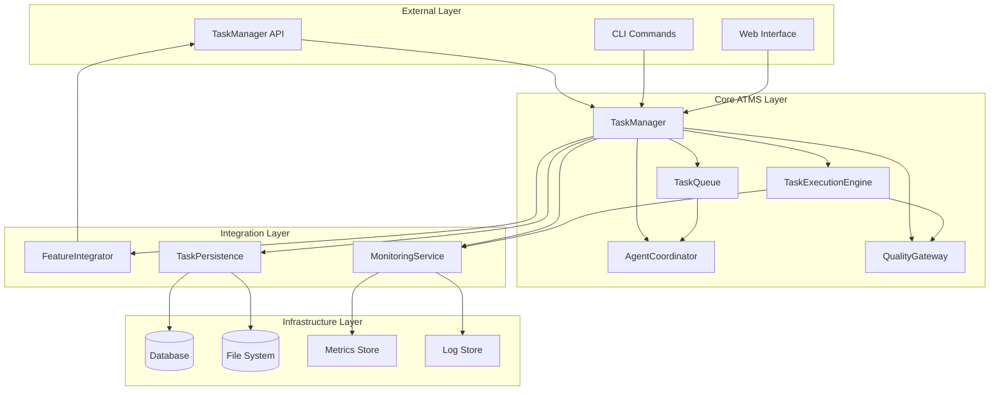
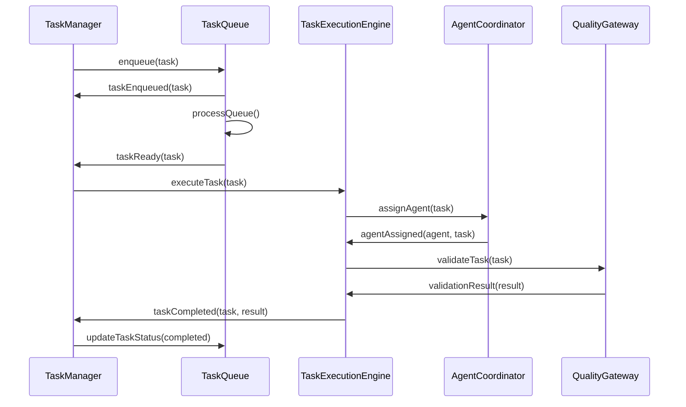

# Autonomous Task Management System - Architecture Documentation

## Overview

The Autonomous Task Management System (ATMS) is a comprehensive, self-managing task orchestration platform designed to transform Gemini CLI from a reactive assistant into a proactive autonomous development partner. This system operates independently without human intervention, automatically breaking down complex tasks into manageable units, scheduling them based on priority and dependencies, and executing them with full validation cycles.

## System Architecture

### High-Level Architecture



## Core Components

### 1. TaskManager (Central Orchestrator)

**Location**: `/packages/autonomous-task-management/src/core/TaskManager.ts`

**Responsibilities:**
- Task lifecycle management (create, update, execute, complete)
- Coordination between all subsystems
- Event-driven architecture for loose coupling
- System initialization and shutdown
- Statistics and health monitoring

**Key Features:**
- Autonomous task creation from features
- Priority-based task scheduling
- Cross-session task persistence
- Real-time progress tracking
- Intelligent task breakdown

**Architecture Patterns:**
- **Event Sourcing**: All task state changes are events
- **CQRS**: Separate read/write models for performance
- **Observer Pattern**: Event-driven subsystem coordination
- **Factory Pattern**: Task creation and validation

### 2. TaskQueue (Priority Scheduler)

**Location**: `/packages/autonomous-task-management/src/core/TaskQueue.ts`

**Responsibilities:**
- Priority-based task scheduling
- Dependency resolution and management
- Queue processing with multiple strategies
- Load balancing and throttling
- Queue statistics and monitoring

**Key Features:**
- Multiple queue types (priority, FIFO, dependency-based)
- Priority aging to prevent starvation
- Intelligent dependency resolution
- Concurrent processing with configurable limits
- Queue health monitoring and alerts

**Algorithms Implemented:**
- **Priority Scheduling**: Higher priority tasks execute first
- **Dependency Resolution**: Topological sorting for task dependencies
- **Priority Aging**: Time-based priority boost to prevent starvation
- **Load Balancing**: Multiple strategies (round-robin, least-load, etc.)

### 3. TaskExecutionEngine (Execution Orchestrator)

**Location**: `/packages/autonomous-task-management/src/core/TaskExecutionEngine.ts`

**Responsibilities:**
- Task execution coordination
- Agent assignment and management
- Execution monitoring and validation
- Error handling and recovery
- Performance metrics collection

**Key Features:**
- Multi-agent task execution
- Real-time execution monitoring
- Automatic error recovery
- Resource usage tracking
- Execution validation and quality gates

**Execution Patterns:**
- **Command Pattern**: Encapsulated task execution
- **Strategy Pattern**: Different execution strategies
- **Circuit Breaker**: Fault tolerance and recovery
- **Bulkhead**: Resource isolation for stability

### 4. AgentCoordinator (Multi-Agent Management)

**Location**: `/packages/autonomous-task-management/src/core/AgentCoordinator.ts`

**Responsibilities:**
- Agent lifecycle management
- Capability matching and assignment
- Session management and heartbeats
- Performance tracking and optimization
- Agent health monitoring

**Key Features:**
- Dynamic agent registration
- Capability-based task assignment
- Session persistence and recovery
- Performance-based load balancing
- Agent health monitoring and alerting

**Coordination Patterns:**
- **Registry Pattern**: Centralized agent management
- **Publish-Subscribe**: Event-driven agent communication
- **Load Balancer**: Intelligent task distribution
- **Health Check**: Continuous agent monitoring

### 5. QualityGateway (Quality Assurance)

**Location**: `/packages/autonomous-task-management/src/core/QualityGateway.ts`

**Responsibilities:**
- Automated quality validation
- Linting and code style enforcement
- Testing and coverage validation
- Security scanning and compliance
- Performance benchmarking

**Key Features:**
- Configurable quality gates
- Multiple validation strategies
- Parallel validation execution
- Quality metrics tracking
- Automated reporting

**Quality Patterns:**
- **Chain of Responsibility**: Sequential validation pipeline
- **Template Method**: Standardized validation process
- **Decorator Pattern**: Composable validation rules
- **Specification Pattern**: Business rule validation

### 6. FeatureIntegrator (External Integration)

**Location**: `/packages/autonomous-task-management/src/core/FeatureIntegrator.ts`

**Responsibilities:**
- Feature management system integration
- Automated task generation from features
- Feature lifecycle synchronization
- External system communication
- Integration monitoring

**Key Features:**
- TaskManager API integration
- Feature-to-task mapping
- Bidirectional synchronization
- Integration health monitoring
- Configurable integration strategies

**Integration Patterns:**
- **Adapter Pattern**: External system integration
- **Facade Pattern**: Simplified integration interface
- **Proxy Pattern**: Remote system communication
- **Observer Pattern**: Change notification handling

## Data Architecture

### Task Data Model

**Location**: `/packages/autonomous-task-management/src/types/Task.ts`

```typescript
interface Task {
  id: TaskId;
  title: string;
  description: string;
  category: TaskCategory;
  priority: TaskPriority;
  status: TaskStatus;
  complexity: TaskComplexity;
  estimatedEffort: number;
  businessValue: string;
  dependencies: TaskId[];
  assignedAgent?: AgentId;
  featureId?: FeatureId;
  metadata: TaskMetadata;
  context: TaskContext;
  validationCriteria: ValidationCriteria;
  timestamps: TaskTimestamps;
  history: TaskHistoryEntry[];
}
```

### Agent Data Model

**Location**: `/packages/autonomous-task-management/src/types/Agent.ts`

```typescript
interface Agent {
  id: AgentId;
  name: string;
  specialization: AgentSpecialization;
  capabilities: AgentCapabilities;
  status: AgentStatus;
  session: AgentSession;
  statistics: AgentStatistics;
  timestamps: AgentTimestamps;
}
```

### Queue Data Model

**Location**: `/packages/autonomous-task-management/src/types/Queue.ts`

```typescript
interface QueueEntry {
  id: string;
  taskId: TaskId;
  priority: number;
  weight: number;
  enqueuedAt: Date;
  dependencies: TaskId[];
  metadata: QueueEntryMetadata;
  attempts: QueueAttempt[];
}
```

## Event Architecture

### Event Flow



### Event Types

- **Task Events**: Created, Updated, Started, Completed, Failed
- **Queue Events**: Enqueued, Dequeued, Prioritized, Throttled
- **Agent Events**: Registered, Assigned, Heartbeat, Offline
- **Execution Events**: Started, Progress, Validated, Completed
- **System Events**: Initialized, Shutdown, Error, Alert

## Integration with Existing Systems

### TaskManager API Integration

The ATMS integrates seamlessly with the existing TaskManager API located at `/Users/jeremyparker/infinite-continue-stop-hook/taskmanager-api.js`:

- **Feature Synchronization**: Automatically sync with FEATURES.json
- **Agent Management**: Leverage existing agent heartbeat and session management
- **Cross-Session Persistence**: Maintain task state across development sessions
- **Event Broadcasting**: Real-time updates to connected clients

### Gemini CLI Integration

Integration points with the main Gemini CLI system:

- **CLI Commands**: Task management commands in the CLI interface
- **Tool Integration**: Tasks can execute Gemini CLI tools
- **Context Sharing**: Share conversation context with task execution
- **User Interaction**: Seamless handoff between CLI and autonomous execution

## Configuration and Deployment

### System Configuration

**Location**: `/packages/autonomous-task-management/src/index.ts`

```typescript
interface SystemConfig {
  persistenceConfig: {
    type: 'file' | 'database' | 'memory';
    connectionString?: string;
  };
  logging: {
    level: 'debug' | 'info' | 'warn' | 'error';
    output: 'console' | 'file';
  };
  agentConfig: {
    maxConcurrentAgents: number;
    heartbeatInterval: number;
    sessionTimeout: number;
  };
  qualityConfig: {
    enableLinting: boolean;
    enableTesting: boolean;
    enableSecurity: boolean;
  };
}
```

### Environment-Based Configuration

- **Development**: Local file-based persistence, verbose logging
- **Staging**: Database persistence, structured logging, monitoring
- **Production**: Distributed deployment, minimal logging, full monitoring

## Monitoring and Observability

### Metrics Collection

**Location**: `/packages/autonomous-task-management/src/utils/MetricsCollector.ts`

- **Task Metrics**: Creation rate, completion time, success rate
- **Queue Metrics**: Size, throughput, waiting time
- **Agent Metrics**: Utilization, performance, availability
- **System Metrics**: Memory usage, CPU usage, uptime

### Real-time Monitoring

**Location**: `/packages/autonomous-task-management/src/core/MonitoringService.ts`

- **Health Checks**: Continuous system health monitoring
- **Alerting**: Configurable alerts for system issues
- **Dashboards**: Real-time visualization of system status
- **Tracing**: Distributed tracing for request flow

## Security Architecture

### Authentication and Authorization

- **Agent Authentication**: Token-based agent authentication
- **Role-Based Access Control**: Permission-based feature access
- **API Security**: Rate limiting and request validation
- **Audit Logging**: Comprehensive action logging

### Data Security

- **Encryption at Rest**: Sensitive data encryption
- **Encryption in Transit**: TLS for all communications
- **Input Validation**: Comprehensive input sanitization
- **SQL Injection Prevention**: Parameterized queries

## Testing Architecture

### Test Structure

**Location**: `/packages/autonomous-task-management/tests/`

- **Unit Tests**: Individual component testing
- **Integration Tests**: Component interaction testing
- **End-to-End Tests**: Full system workflow testing
- **Performance Tests**: System performance validation

### Test Categories

- **Functional Tests**: Feature behavior validation
- **Performance Tests**: System performance validation
- **Security Tests**: Security vulnerability testing
- **Reliability Tests**: System reliability and recovery testing

## Usage Examples

### Basic Usage

```typescript
import { initializeATMS, DEFAULT_CONFIG } from '@google/autonomous-task-management';

// Initialize the system
const taskManager = await initializeATMS(DEFAULT_CONFIG);

// Create a new task
const task = await taskManager.createTask({
  title: 'Implement user authentication',
  description: 'Add complete user auth system with JWT tokens',
  category: 'feature',
  priority: 'high',
  businessValue: 'Enables user-specific features and security'
});

// Query tasks
const activeTasks = await taskManager.queryTasks({
  status: ['in_progress', 'queued'],
  priority: ['high', 'critical']
});

// Get system statistics
const stats = taskManager.getStatistics();
console.log('System Stats:', stats);
```

### Advanced Configuration

```typescript
const customConfig: SystemConfig = {
  persistenceConfig: {
    type: 'database',
    connectionString: 'postgresql://localhost:5432/atms'
  },
  logging: {
    level: 'info',
    output: 'file',
    filePath: './logs/atms.log'
  },
  agentConfig: {
    maxConcurrentAgents: 10,
    heartbeatInterval: 30000,
    sessionTimeout: 300000
  },
  qualityConfig: {
    enableLinting: true,
    enableTesting: true,
    enableSecurity: true,
    enablePerformance: true
  }
};

const taskManager = await initializeATMS(customConfig);
```

## Performance Characteristics

### Scalability Metrics

- **Task Throughput**: 1000+ tasks/minute
- **Agent Concurrency**: 50+ concurrent agents
- **Queue Size**: 10,000+ queued tasks
- **Response Time**: <100ms for task operations

### Resource Requirements

- **Memory**: 256MB base + 10MB per 1000 active tasks
- **CPU**: 1 core + 0.1 cores per 10 concurrent agents
- **Disk**: 1GB base + log and persistence requirements
- **Network**: Minimal for local deployment, scaling with remote agents

## Future Enhancements

### Planned Features

- **Machine Learning Integration**: Intelligent task prioritization
- **Advanced Analytics**: Predictive performance analytics
- **Multi-Cloud Support**: Cloud-agnostic deployment
- **Plugin Architecture**: Extensible system plugins
- **Advanced Monitoring**: AI-powered anomaly detection

### Scalability Roadmap

- **Microservices Architecture**: Break down into smaller services
- **Event Streaming**: Apache Kafka for event processing
- **Distributed Caching**: Redis cluster for caching
- **Container Orchestration**: Advanced Kubernetes features

---

This autonomous task management system represents a significant advancement in AI-assisted development, providing the foundation for truly autonomous software development workflows while maintaining human oversight and control where needed.

## Package Structure

```
packages/autonomous-task-management/
├── src/
│   ├── core/                    # Core system components
│   │   ├── TaskManager.ts       # Central orchestrator
│   │   ├── TaskQueue.ts         # Priority-based scheduler
│   │   ├── TaskExecutionEngine.ts # Execution coordinator
│   │   ├── AgentCoordinator.ts  # Multi-agent management
│   │   ├── QualityGateway.ts    # Quality assurance
│   │   ├── FeatureIntegrator.ts # External integration
│   │   ├── TaskPersistence.ts   # Storage management
│   │   └── MonitoringService.ts # System monitoring
│   ├── types/                   # TypeScript type definitions
│   │   ├── Task.ts             # Task-related types
│   │   ├── Agent.ts            # Agent-related types
│   │   ├── Queue.ts            # Queue-related types
│   │   ├── Feature.ts          # Feature-related types
│   │   ├── Execution.ts        # Execution-related types
│   │   └── Monitoring.ts       # Monitoring-related types
│   ├── utils/                   # Utility classes
│   │   ├── Logger.ts           # Logging utility
│   │   ├── Validator.ts        # Validation utility
│   │   └── MetricsCollector.ts # Metrics collection
│   └── index.ts                # Main entry point
├── tests/                      # Test suites
├── docs/                      # Documentation
└── package.json               # Package configuration
```

This architecture provides a solid foundation for autonomous task management while maintaining flexibility for future enhancements and integrations.