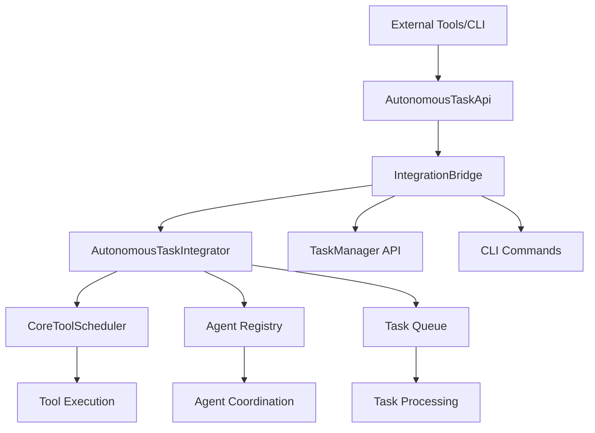

# Autonomous Task Management System

## Overview

The Autonomous Task Management System is a comprehensive integration layer that connects autonomous task management components within the Gemini CLI ecosystem. It provides seamless coordination between the TaskManager API, CoreToolScheduler, A2A Server, and TodoWrite tools to enable intelligent, automated task orchestration.

## Architecture



## Key Components

### 1. AutonomousTaskIntegrator
- **Purpose**: Core orchestrator for autonomous task management
- **Responsibilities**: Task queue management, agent coordination, execution scheduling
- **Features**: Event-driven architecture, dependency resolution, performance tracking

### 2. IntegrationBridge
- **Purpose**: Bridge between internal systems and external APIs
- **Responsibilities**: TaskManager API integration, CLI command execution, cross-session persistence
- **Features**: Real-time synchronization, heartbeat monitoring, error handling

### 3. AutonomousTaskApi
- **Purpose**: RESTful API interface for external tool integration
- **Responsibilities**: Request routing, response formatting, authentication
- **Features**: HTTP-like interface, comprehensive endpoint coverage, request tracking

### 4. Configuration Management
- **Purpose**: Centralized configuration system with environment overrides
- **Responsibilities**: Settings validation, file-based persistence, runtime updates
- **Features**: Environment variable support, configuration watching, validation

## Quick Start

### Basic Usage

```typescript
import {
  createAutonomousTaskApi,
  getAutonomousTaskConfig,
  AutonomousTaskIntegrator,
  IntegrationBridge
} from '@google/gemini-cli-core';

// Initialize the system
const config = getAutonomousTaskConfig();
const api = await createAutonomousTaskApi(config);

// Create a task
const task = await api.createTask({
  title: 'Implement feature X',
  description: 'Add new functionality for feature X',
  type: 'implementation',
  priority: 'high',
  requiredCapabilities: ['frontend', 'backend']
});

// Register an agent
await api.registerAgent({
  id: 'my-agent-001',
  capabilities: ['frontend', 'backend', 'testing'],
  maxConcurrentTasks: 3
});
```

## Core Features

### Task Management
- ✅ Automatic task creation from approved features
- ✅ Priority-based task scheduling
- ✅ Dependency resolution and validation
- ✅ Task lifecycle management (queued → assigned → in_progress → completed)
- ✅ Real-time progress tracking and updates

### Agent Coordination
- ✅ Dynamic agent registration and capability matching
- ✅ Performance-based task assignment
- ✅ Concurrent task execution limits
- ✅ Heartbeat monitoring and offline detection
- ✅ Load balancing across available agents

### Integration Features
- ✅ TaskManager API synchronization
- ✅ CLI command execution with context
- ✅ Cross-session task persistence
- ✅ Real-time event broadcasting
- ✅ Comprehensive error handling and recovery

## Documentation Structure

- [API Reference](./api-reference.md) - Comprehensive API documentation
- [Configuration Guide](./configuration.md) - Detailed configuration options
- [Integration Guide](./integration.md) - How to integrate with existing systems
- [Examples](./examples/) - Code examples and use cases
- [Architecture](./architecture.md) - System architecture and design decisions
- [Troubleshooting](./troubleshooting.md) - Common issues and solutions
