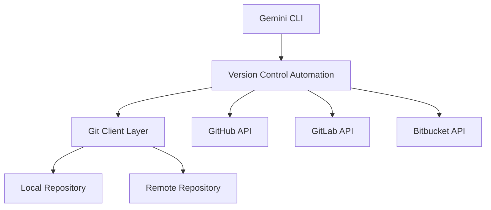
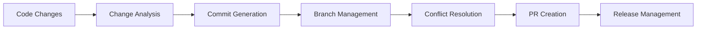

# Version Control Automation System - Architecture Design

## System Overview

The Version Control Automation System extends Gemini CLI with intelligent version control capabilities including automated commit message generation, branch management, merge conflict resolution, pull request automation, and changelog generation to dramatically reduce version control overhead and improve development workflow efficiency.

## Core Components

### 1. Intelligent Commit Message Generator

**Purpose**: Automatically generate meaningful, conventional commit messages based on code analysis

**Key Features**:

- **Automatic Type Detection**: Analyzes code changes to determine commit type (feat, fix, refactor, etc.)
- **Scope Inference**: Identifies affected modules, components, or areas of the codebase
- **Description Generation**: Creates clear, concise descriptions of changes made
- **Breaking Change Detection**: Automatically detects and flags breaking changes
- **Convention Compliance**: Ensures all messages follow conventional commit standards
- **Multi-Language Support**: Understands changes across different programming languages

**Implementation**: `CommitMessageGenerator.ts`

```typescript
interface CommitMessageGenerator {
  generateCommitMessage(changes: CodeAnalysis): Promise<CommitMessage>;
  analyzeChanges(filePaths: string[]): Promise<CodeAnalysis>;
  detectCommitType(analysis: CodeAnalysis): CommitType;
  extractScope(analysis: CodeAnalysis): string;
  generateDescription(analysis: CodeAnalysis): string;
}
```

### 2. Automated Branch Management

**Purpose**: Intelligent branch creation, naming, and lifecycle management

**Key Features**:

- **Smart Branch Naming**: Generates branch names following team conventions
- **Branch Type Detection**: Automatically categorizes branches (feature, hotfix, release)
- **Base Branch Selection**: Intelligently chooses appropriate base branch
- **Branch Protection**: Automatically applies protection rules based on branch type
- **Lifecycle Management**: Tracks branch status and suggests cleanup actions
- **Integration Awareness**: Considers CI/CD pipeline requirements

**Implementation**: `BranchManager.ts`

```typescript
interface BranchManager {
  createBranch(options: BranchCreationOptions): Promise<BranchInfo>;
  suggestBranchName(type: BranchType, context: string): string;
  applyProtectionRules(branch: string): Promise<void>;
  cleanupMergedBranches(): Promise<string[]>;
  analyzeBranchHealth(): Promise<BranchHealthReport>;
}
```

### 3. Smart Merge Conflict Resolution

**Purpose**: Automated and semi-automated resolution of merge conflicts

**Key Features**:

- **Conflict Classification**: Categorizes conflicts by type and complexity
- **Intelligent Resolution**: Uses context analysis to suggest resolutions
- **Pattern Recognition**: Learns from previous conflict resolutions
- **Safe Auto-Resolution**: Automatically resolves low-risk conflicts
- **Resolution Strategies**: Multiple strategies for different conflict types
- **Human-in-the-Loop**: Interactive resolution for complex conflicts

**Implementation**: `ConflictResolver.ts`

```typescript
interface ConflictResolver {
  detectConflicts(): Promise<MergeConflict[]>;
  analyzeConflict(conflict: MergeConflict): ConflictContext;
  suggestResolution(conflict: MergeConflict): ConflictResolution;
  autoResolveConflicts(conflicts: MergeConflict[]): Promise<ResolutionResult>;
  interactiveResolve(conflict: MergeConflict): Promise<ConflictResolution>;
}
```

### 4. Pull Request Automation

**Purpose**: Streamlined pull request creation and management

**Key Features**:

- **Auto PR Creation**: Creates PRs automatically based on branch patterns
- **Smart Title/Description**: Generates meaningful PR titles and descriptions
- **Reviewer Assignment**: Intelligently assigns reviewers based on code ownership
- **Label Management**: Automatically applies relevant labels
- **Template Integration**: Uses PR templates with intelligent content filling
- **Review Workflow**: Manages review requests and follow-ups

**Implementation**: `PullRequestAutomation.ts`

```typescript
interface PullRequestAutomation {
  createPullRequest(options: PullRequestOptions): Promise<PullRequest>;
  generatePRContent(branch: BranchInfo): Promise<PRContent>;
  assignReviewers(changes: CodeAnalysis): Promise<string[]>;
  applyLabels(pr: PullRequest): Promise<string[]>;
  managePRWorkflow(pr: PullRequest): Promise<WorkflowAction[]>;
}
```

### 5. Semantic Versioning Engine

**Purpose**: Automated version management and release preparation

**Key Features**:

- **Version Calculation**: Determines next version based on commit history
- **Semantic Analysis**: Analyzes commits for major/minor/patch classification
- **Release Notes**: Generates comprehensive release notes
- **Changelog Integration**: Maintains automated changelog
- **Pre-release Validation**: Performs checks before version bumps
- **Multi-format Support**: Supports various versioning schemes

**Implementation**: `SemanticVersioning.ts`

```typescript
interface SemanticVersioning {
  calculateNextVersion(commits: CommitInfo[]): Promise<SemanticVersion>;
  generateReleaseNotes(version: string): Promise<ReleaseNotes>;
  validateRelease(version: string): Promise<ValidationResult>;
  createRelease(version: string): Promise<Release>;
}
```

### 6. Changelog Generation Engine

**Purpose**: Automated changelog creation and maintenance

**Key Features**:

- **Commit Parsing**: Analyzes commit history for changelog entries
- **Categorization**: Groups changes by type (features, fixes, breaking)
- **Release Tracking**: Maintains version-based changelog sections
- **Format Support**: Supports multiple changelog formats (Keep a Changelog, etc.)
- **Template Customization**: Allows custom changelog templates
- **Integration Links**: Automatically links to issues and pull requests

**Implementation**: `ChangelogGenerator.ts`

```typescript
interface ChangelogGenerator {
  generateChangelog(fromVersion?: string): Promise<ChangelogEntry[]>;
  parseCommitHistory(range: string): Promise<CommitInfo[]>;
  categorizeChanges(commits: CommitInfo[]): Promise<CategorizedChanges>;
  formatChangelog(entries: ChangelogEntry[]): Promise<string>;
  updateChangelogFile(content: string): Promise<void>;
}
```

### 7. Branch Protection Manager

**Purpose**: Automated branch protection rule management

**Key Features**:

- **Rule Definition**: Define protection rules based on branch patterns
- **Automatic Application**: Apply rules to new branches automatically
- **Policy Enforcement**: Ensure compliance with team policies
- **Exception Handling**: Manage exceptions and overrides
- **Audit Trail**: Track protection rule changes
- **Integration Security**: Coordinate with CI/CD security requirements

**Implementation**: `BranchProtectionManager.ts`

```typescript
interface BranchProtectionManager {
  applyProtectionRules(branch: string): Promise<void>;
  validateProtectionCompliance(branch: string): Promise<ComplianceResult>;
  manageExceptions(branch: string, reason: string): Promise<void>;
  auditProtectionChanges(): Promise<AuditLog[]>;
}
```

## System Integration

### Git Integration Layer



### Workflow Integration



## Configuration Management

### Default Configuration

```typescript
export const DEFAULT_VC_AUTOMATION_CONFIG: VCAutomationConfig = {
  vcsType: VCSType.GIT,
  repositoryPath: process.cwd(),
  defaultBranch: 'main',
  commitMessage: {
    enableIntelligentGeneration: true,
    includeScope: true,
    maxDescriptionLength: 72
  },
  branchManagement: {
    enableAutomatedCreation: true,
    namingConvention: '{type}/{issue}-{description}',
    autoDeleteMerged: true
  },
  conflictResolution: {
    defaultStrategy: ConflictResolutionStrategy.INTELLIGENT,
    enableIntelligentResolution: true,
    confidenceThreshold: 0.8
  }
};
```

## Security Considerations

### Access Control
- **Repository Permissions**: Validates user permissions before operations
- **Branch Protection**: Enforces protection rules consistently
- **Secure Token Management**: Handles API tokens securely
- **Audit Logging**: Comprehensive logging of all automation actions

### Safety Mechanisms
- **Dry Run Mode**: Preview changes before applying
- **Rollback Support**: Ability to undo automated actions
- **Human Override**: Allow manual override of automated decisions
- **Validation Gates**: Multi-stage validation before critical operations

## Performance Optimization

### Caching Strategy
- **Repository Metadata**: Cache repository information
- **Conflict Patterns**: Cache resolution patterns for reuse
- **API Response Caching**: Cache external API responses
- **Incremental Analysis**: Only analyze changed files

### Batch Operations
- **Bulk Branch Operations**: Process multiple branches efficiently
- **Batch Commit Analysis**: Analyze multiple commits together
- **Parallel Processing**: Parallelize independent operations

## Monitoring and Analytics

### Metrics Collection
- **Automation Success Rate**: Track successful automated actions
- **Time Savings**: Measure time saved through automation
- **Conflict Resolution Rate**: Monitor automated conflict resolution
- **User Satisfaction**: Track user feedback and adoption

### Reporting
- **Usage Analytics**: Detailed usage statistics
- **Performance Metrics**: System performance monitoring
- **Error Tracking**: Comprehensive error logging and analysis
- **Trend Analysis**: Long-term trend identification

## Extension Points

### Plugin Architecture
- **Custom Commit Types**: Support custom commit type definitions
- **Resolution Strategies**: Pluggable conflict resolution strategies
- **Workflow Integrations**: Custom workflow integrations
- **Notification Systems**: Pluggable notification mechanisms

### API Integration
- **Webhook Support**: React to external events
- **REST API**: Full REST API for external integrations
- **Event System**: Comprehensive event system for extensions
- **Configuration API**: Dynamic configuration management